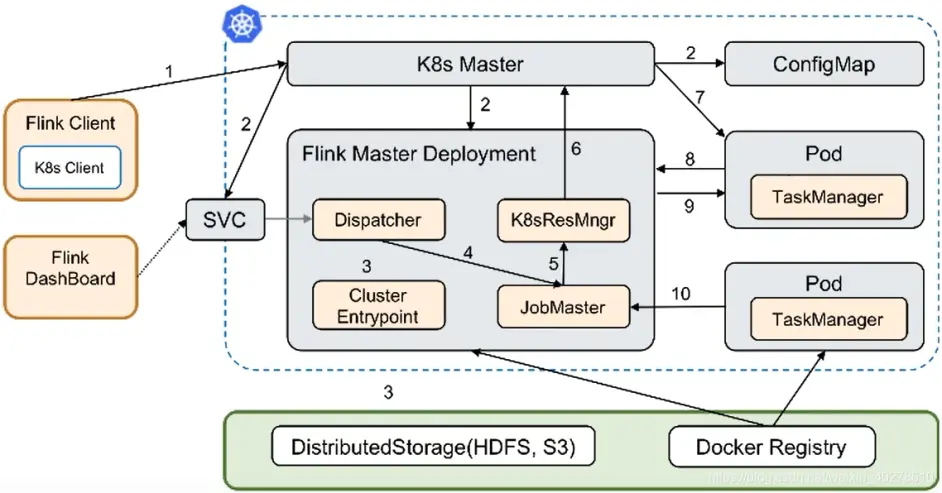

<a name="OduFi"></a>
# Flink 介绍
参考文档:

- [Kubernetes Setup - Flink 官网](https://nightlies.apache.org/flink/flink-docs-release-1.13/docs/deployment/resource-providers/standalone/kubernetes/)

本文采用版本 `flink:1.13.6-scala_2.12-java8` , 也可以采用最新的.
<a name="LGQeW"></a>
## 运行模式

|  | Session | PerJob |
| --- | --- | --- |
| 集群 | 一个 Flink Cluster | 独立 Flink Cluster |
| 提交作业 | 启动后朝 Web UI 中提交 | 提前将 jar 包构建进镜像 |
| 任务和隔离性 | 所有 Job 都在一起 | 每个 Job 都在资源隔离 |

<a name="z2Ct1"></a>
## Flink native on Kubernetes

[https://nightlies.apache.org/flink/flink-docs-master/docs/deployment/resource-providers/native_kubernetes/](https://nightlies.apache.org/flink/flink-docs-master/docs/deployment/resource-providers/native_kubernetes/)

> Kubernetes 是一种流行的容器编排系统，用于自动化计算机应用程序的部署、扩展和管理。
> Flink 的原生 Kubernetes 集成允许您直接将 Flink 部署在正在运行的 Kubernetes 集群上。
> 此外，Flink 能够根据所需资源动态分配和取消分配 TaskManager，因为它可以直接与 Kubernetes 对话。




要求：

- Kubernetes >= 1.9
- 可通过`~/.kube/config` 访问 Kubernetes 和操作 Pod
- 启用 Kubernetes DNS
- 具有 RBAC 权限的服务帐户来创建、删除 Pod

使用了 `fabric8io/kubernetes-client`来连接 Kubernetes , 配置参考

- [fabric8io/kubernetes-client 配置参数 - GitHub](https://github.com/fabric8io/kubernetes-client#configuring-the-client)
- [Flink native 配置参数 - Flink 官网](https://nightlies.apache.org/flink/flink-docs-master/docs/deployment/config/#kubernetes)

<a name="qeDyM"></a>
### 安装步骤

下载二进制包：

```bash
FLINK_VERSION=1.13.6
SCALA_VERSION=2.12
wget https://dlcdn.apache.org/flink/flink-${FLINK_VERSION}/flink-${FLINK_VERSION}-bin-scala_${SCALA_VERSION}.tgz
tar -xf flink-*.tgz
```

Application Mode 要求用户代码与 Flink 镜像捆绑在一起：

```dockerfile
FROM flink
RUN mkdir -p $FLINK_HOME/usrlib
COPY /path/of/my-flink-job.jar $FLINK_HOME/usrlib/my-flink-job.jar
```

```bash
docker build -f Dockerfile -t flink:test .
```

以上打包后直接运行命令部署，`local`是当前模式下指定 Jar 包的唯一方法：

```bash
# kubectl delete ns flink-native
kubectl delete ns flink-native
kubectl delete clusterrolebinding flink-role-binding-flink-native
kubectl create ns flink-native

# RBAC
# 这里我省事直接 给了cluster-admin
kubectl create serviceaccount flink-native -n flink-native
kubectl create clusterrolebinding flink-role-binding-flink-native --clusterrole=cluster-admin --serviceaccount=flink-native:flink-native

kubectl delete pv flink-checkpoint-pv
kubectl apply -f flink-checkpoint-pv.yaml
kubectl apply -f flink-checkpoint-pvc.yaml

CLUSTER_ID=flink-native-cluster
bin/flink run-application \
  --target kubernetes-application \
  -Dblob.server.port=6124 \
  -Dtaskmanager.rpc.port=6122 \
  -Dkubernetes.namespace=flink-native \
  -Dkubernetes.cluster-id=${CLUSTER_ID} \
  -Dkubernetes.service-account=flink-native \
  -Dkubernetes.rest-service.exposed.type=ClusterIP \
  -Dkubernetes.container.image=flink:test \
  -Dkubernetes.container.image.pull-policy=Always \
  -Dkubernetes.pod-template-file=pod-template.yaml \
  local:///opt/flink/usrlib/FlinkTutorial-1.0-SNAPSHOT-jar-with-dependencies.jar
  
  
    
```

<a name="OUITs"></a>
### 常见问题
<a name="K2kBd"></a>
#### 启动报 Kubernetes 没有权限

检查 `~/.kube/config` 正确：

```bash
ln -sf /etc/kubernetes/admin.conf ~/.kube/config
```

此外还需要保证 [RBAC on Kubernetes](https://nightlies.apache.org/flink/flink-docs-release-1.13/docs/deployment/resource-providers/native_kubernetes/#rbac)：

```bash
kubectl delete clusterrolebinding flink-role-binding-flink-native

# RBAC
kubectl create serviceaccount flink-native -n flink-native
kubectl create clusterrolebinding flink-role-binding-flink-native \
  --clusterrole=edit \
  --serviceaccount=flink-native:flink-native
```

<a name="KB5Rc"></a>
#### BouncyCastle 依赖不存在

如果报如下报错：

```bash
io.fabric8.kubernetes.client.KubernetesClientException: JcaPEMKeyConverter is provided by BouncyCastle, an optional dependency. To use support for EC Keys you must explicitly add this dependency to classpath.
```

到 [mvnrepository](https://mvnrepository.com/) 下载以下依赖的 jar 包，上传到 Flink 客户端的 `$FLINK_HOME/lib` 下

```xml
<!--
    目前使用的<version>1.69</version>
    最新版本是<version>1.70</version>
  -->
<dependency>
    <groupId>org.bouncycastle</groupId>
    <artifactId>bcpkix-jdk15on</artifactId>
</dependency>
<dependency>
    <groupId>org.bouncycastle</groupId>
    <artifactId>bcprov-jdk15on</artifactId>
</dependency>
```

<a name="kTyn0"></a>
#### 找不到主类或者依赖

请在项目中引用如下 maven 插件，然后重新 `mvn package`，然后我们需要使用 Fat Jar 来部署：

- 他将在 `MANIFEST.MF` 写入 Flink 作业的主类
- 打包时捆绑第三方依赖

```xml
<plugin>
    <groupId>org.apache.maven.plugins</groupId>
    <artifactId>maven-assembly-plugin</artifactId>
    <version>3.0.0</version>
    <configuration>
        <archive>
            <manifest>
                <mainClass>io.github.flink.SlowQueryLogTest</mainClass>
            </manifest>
        </archive>
        <descriptorRefs>
            <descriptorRef>jar-with-dependencies</descriptorRef>
        </descriptorRefs>
    </configuration>
    <executions>
        <execution>
            <id>make-assembly</id>
            <phase>package</phase>
            <goals>
                <goal>single</goal>
            </goals>
        </execution>
    </executions>
</plugin>
```

或者另一种方案（不推荐）是用 `maven-jar-plugin`来 `mvn jar:jar`：

- 他将在 `MANIFEST.MF` 写入 Flink 作业的主类
- 打包时不捆绑第三方依赖，但需要手动把依赖包放到 `$FLINK_HOME/usrlib` 下

```xml
<plugin>
    <groupId>org.apache.maven.plugins</groupId>
    <artifactId>maven-jar-plugin</artifactId>
    <version>3.2.0</version>
    <configuration>
        <archive>
            <manifestEntries>
                <Main-Class>io.github.flink.SlowQueryLogTest</Main-Class>
            </manifestEntries>
        </archive>
    </configuration>
</plugin>
```

```bash
CLUSTER_ID=flink-native-cluster
bin/flink list \
  --target kubernetes-application \
  -Dkubernetes.cluster-id=${CLUSTER_ID} \
  -Dkubernetes.namespace=flink-native

bin/flink cancel \
  a1fe43441615a55edb0411c3c7d53c94 \
  --target kubernetes-application \
  -Dkubernetes.cluster-id=${CLUSTER_ID} \
  -Dkubernetes.namespace=flink-native

bin/flink savepoint \
  e229c328cf940c7e71a3ecd29fe01fda \
  /opt/flink/checkpoint \
  --target kubernetes-application \
  -Dkubernetes.cluster-id=${CLUSTER_ID} \
  -Dkubernetes.namespace=flink-native

echo 'stop' | bin/kubernetes-session.sh \
    -Dkubernetes.cluster-id=${CLUSTER_ID} \
    -Dexecution.attached=true
```

<a name="PjUOH"></a>
### kubernetes.pod-template-file

如果以上参数都不能覆盖所需的需求的话，可以使用 `-Dkubernetes.pod-template-file=pod-template.yaml` 来指定需要使用的 pod 文件：

```yaml
apiVersion: v1
kind: Pod
metadata:
  name: flink-native-cluster
spec:
  containers:
    # Do not change the main container name
    - name: flink-main-container
      resources:
        requests:
          ephemeral-storage: 2048Mi
        limits:
          ephemeral-storage: 2048Mi
      volumeMounts:
        - mountPath: /opt/flink/checkpoint
          name: flink-volume-checkpoint
  volumes:
    - name: flink-volume-checkpoint
      persistentVolumeClaim:
        claimName: flink-checkpoint-pvc
```

```yaml
apiVersion: v1
kind: PersistentVolume
metadata:
  name: flink-checkpoint-pv
spec:
  accessModes:
    - ReadWriteMany
  capacity:
    storage: 1G
  nfs:
    path: /export/mid-devops/flink
    server: 10.65.63.19
  persistentVolumeReclaimPolicy: Retain
  storageClassName: ""
  volumeMode: Filesystem
```

```yaml
apiVersion: v1
kind: PersistentVolumeClaim
metadata:
  name: flink-checkpoint-pvc
spec:
  accessModes:
    - ReadWriteMany
  resources:
    requests:
      storage: 1G
  storageClassName: ""
  volumeMode: Filesystem
  volumeName: flink-checkpoint-pv
```

`pod-template.yaml`

```yaml
apiVersion: v1
kind: Pod
metadata:
  name: jobmanager-pod-template
spec:
  initContainers:
    - name: artifacts-fetcher
      image: busybox:latest
      # Use wget or other tools to get user jars from remote storage
      command: [ 'wget', 'https://path/of/StateMachineExample.jar', '-O', '/flink-artifact/myjob.jar' ]
      volumeMounts:
        - mountPath: /flink-artifact
          name: flink-artifact
  containers:
    # Do not change the main container name
    - name: flink-main-container
      resources:
        requests:
          ephemeral-storage: 2048Mi
        limits:
          ephemeral-storage: 2048Mi
      volumeMounts:
        - mountPath: /opt/flink/volumes/hostpath
          name: flink-volume-hostpath
        - mountPath: /opt/flink/artifacts
          name: flink-artifact
        - mountPath: /opt/flink/log
          name: flink-logs
      # Use sidecar container to push logs to remote storage or do some other debugging things
    - name: sidecar-log-collector
      image: sidecar-log-collector:latest
      command: [ 'command-to-upload', '/remote/path/of/flink-logs/' ]
      volumeMounts:
        - mountPath: /flink-logs
          name: flink-logs
  volumes:
    - name: flink-volume-hostpath
      hostPath:
        path: /tmp
        type: Directory
    - name: flink-artifact
      emptyDir: { }
    - name: flink-logs
      emptyDir: { }
```

<a name="N6evB"></a>
### 测试

未开启 checkpoint 情形<br />kill taskmanager 服务将停止<br />kill jobmanager 服务将重新拉起 taskmanager 大约 15 ~ 20 s

<a name="sZMYq"></a>
## 连接器
<a name="OTBw7"></a>
### 调试 Kafka Connector

```bash
docker exec -it kafka bash
cd /opt/kafka
bin/kafka-console-producer.sh --broker-list localhost:9092 --topic slowquery_local
```

```
# Time: 2022-04-13T04:00:02.179540Z|# User@Host: root[root] @ localhost []  Id: 35408|# Query_time: 0.003405  Lock_time: 0.001458 Rows_sent: 0  Rows_examined: 159|SET timestamp=1649822402;|SELECT 1 FROM dual; --k8s测试
```

<a name="EVxH1"></a>
## Checkpoint & Savepoint
<a name="aADYc"></a>
### 区别
|  | Checkpoint | Savepoint |
| --- | --- | --- |
| 业务功能 | 侧重容错，即作业失败后，从早先的 checkpoint 恢复 | 侧重维护，即作业需要在人工干预下重启、升级、迁移时，先将状态整体写入可靠存储，再从 savepoint 恢复现场。本身是特殊的 checkpoint |
| 触发 | TaskManager 定时触发快照并自动清理 | Savepoint 面向用户，完全根据用户的需要触发与清理 |
| 频次 | 频率比较高 | 人工手动 |
| 性能 | 存储格式非常轻量级 | 二进制形式存储所有状态数据和元数据，速度慢，开销大 |
| 兼容性 | 不保证改变并行度和升级的兼容性 | 并行度改变或代码升级，仍然能正常恢复 |
| 增量/全量 | 增量 | 全量 |
|  |  |  |


```java
StreamExecutionEnvironment env = StreamExecutionEnvironment.getExecutionEnvironment();
env.enableCheckpointing(60 * 1000);
env.setStateBackend(new HashMapStateBackend());
env.getCheckpointConfig().setCheckpointStorage(checkpointDirectory);
env.getCheckpointConfig().enableExternalizedCheckpoints(ExternalizedCheckpointCleanup.RETAIN_ON_CANCELLATION);
env.getCheckpointConfig().setCheckpointingMode(CheckpointingMode.EXACTLY_ONCE);
```

推荐使用 HDFS 作为 HA 的 FS。<br /> <br />Savepoint 命令行，注意这个 jar 需要 MANIFEST.MF 里有 Main-Class：

```bash
bin/flink run -s /path/to/savepoint your_flink.jar
```
<a name="c5Smm"></a>
### 重启策略
| **重启策略** | **具体策略** |
| --- | --- |
| 固定间隔重启 | 固定间隔时间重启, 尝试指定次数.<br />若仍然失败, 则最终失败. |
| 失败率重启 | 失败后重启, 重启后等待一段时间.<br />每个时间区间内失败次数超过指定次数时, 最终失败. |
| 不重启 | 直接失败, 永不重启. |


1. 前提是开启了 checkpoint 才会调用重启策略
1. 如果开启了 checkpoint, 但未配置任何重启策略, 则无限自动重启
1. 重启策略可以在 `flink-conf.yaml` 中配置, 也可以在代码中配置 (为单独作业)

`flink-conf.yaml`

```yaml
# 固定间隔重启
restart-strategy: fixed-delay
restart-strategy.fixed-delay.attempts: 3
restart-strategy.fixed-delay.delay: 10 s

# 失败率重启
restart-strategy: failure-rate
restart-strategy.failure-rate.max-failures-per-interval: 3
restart-strategy.failure-rate.failure-rate-interval: 5 min
restart-strategy.failure-rate.delay: 10 s

# 不重启
restart-strategy: none # 或者 off / disable
```

Java 代码中硬编码

```java
StreamExecutionEnvironment env = StreamExecutionEnvironment.getExecutionEnvironment();

// 固定间隔重启
env.setRestartStrategy(RestartStrategies.fixedDelayRestart(3, Time.of(10 , TimeUnit.SECONDS)));

// 失败率重启
env.setRestartStrategy(RestartStrategies.failureRateRestart(3, Time.of(5, TimeUnit.MINUTES), Time.of(10, TimeUnit.SECONDS)));

// 不重启
env.setRestartStrategy(RestartStrategies.noRestart());
```

<a name="frna1"></a>
### 恢复策略
| 恢复策略 | **具体策略** |
| --- | --- |
| 重启所有故障恢复策略 | 重新启动作业中所有任务以从失败任务中恢复 |
| 重启流水线区域故障恢复策略 | 该策略会将作业中的所有 Task 划分为几个 Region. 当有 Task 发生故障时, 它会尝试找出进行故障恢复需要重启的最小 Region 集合. |

Region 是指以 Pipelined 形式进行数据交换的 Task 集合. 也就是说, Batch 形式的数据交换会构成 Region 的边界

- DataStream 和 流式 Table/SQL 作业的所有数据交换都是 Pipelined 形式
- 批处理式 Table/SQL 作业的所有数据交换默认都是 Batch 形式的
- DataSet 作业中的数据交换形式会根据 ExecutionConfig 中配置的 ExecutionMode 决定

需要重启的 Region 的判断逻辑如下:

- 出错 Task 所在 Region 需要重启
- 如果要重启的 Region 需要消费的数据有部分无法访问（丢失或损坏）, 产出该部分数据的 Region 也需要重启
- 需要重启的 Region 的下游 Region 也需要重启. 这是出于保障数据一致性的考虑, 因为一些非确定性的计算或者分发会导致同一个 Result Partition 每次产生时包含的数据都不相同

```yaml
jobmanager.execution.failover-strategy: full

jobmanager.execution.failover-strategy: region
```
