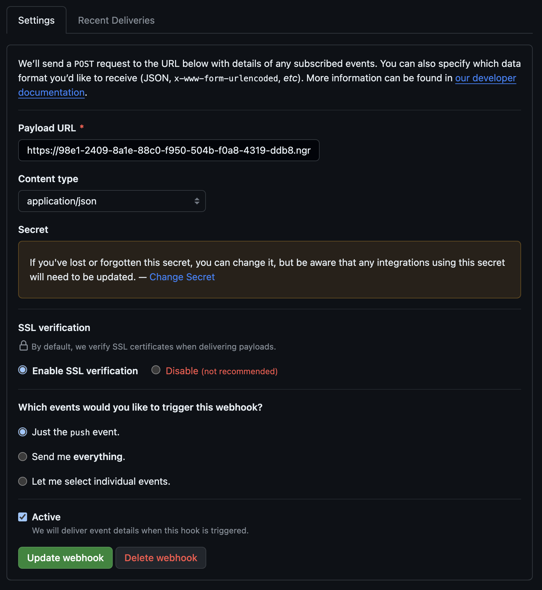

# GitHub 工具链
参考文档：

- [https://docs.github.com/cn/developers/webhooks-and-events/webhooks/about-webhooks](https://docs.github.com/cn/developers/webhooks-and-events/webhooks/about-webhooks)

### ngrok 工具
插叙一下 `ngrok` 的使用，启动后 `Forword` 字段会提示外网的域名。<br />`ngrok` 可以在一个两个小时的过期时间内将本地端口上的服务代理到公网，用于本地的调试和构建。
```bash
wget https://bin.equinox.io/c/bNyj1mQVY4c/ngrok-v3-stable-linux-amd64.tgz
tar xvzf ngrok-v3-stable-linux-amd64.tgz -C /usr/local/bin 
ngrok http 80
```
```bash
ngrok                                                                                      (Ctrl+C to quit)
                                                                                                           
Visit http://localhost:4040/ to inspect, replay, and modify your requests                                  
                                                                                                           
Session Status                online                                                                       
Session Expires               1 hour, 59 minutes                                                           
Terms of Service              https://ngrok.com/tos                                                        
Version                       3.1.0                                                                        
Region                        Japan (jp)                                                                   
Latency                       -                                                                            
Web Interface                 http://127.0.0.1:4040                                                        
Forwarding                    https://7543-121-196-30-39.jp.ngrok.io -> http://localhost:8081              
                                                                                                           
Connections                   ttl     opn     rt1     rt5     p50     p90                                  
                              0       0       0.00    0.00    0.00    0.00 
```

## GitHub Webhook
钩子订阅 GitHub 事件，当事件触发时会朝指定的外部 URL 推送 HTTP POST 请求。

- 单个事件的 Webhook 不能超过 20 个。

### 签名
为仓库配置 Webhook 需要设置一个 Secret，只有 GitHub 和自己开发的服务端后台知道。Webhook 会用这个 Secret 来为 Webhook 请求体的 JSON 计算 `HMAC+SHA1` 签名，添加到请求头中。服务端验证请求签名一致后，即可判断 Webhook 请求是由 GitHub 发出，不是第三方伪造或篡改的。<br />
