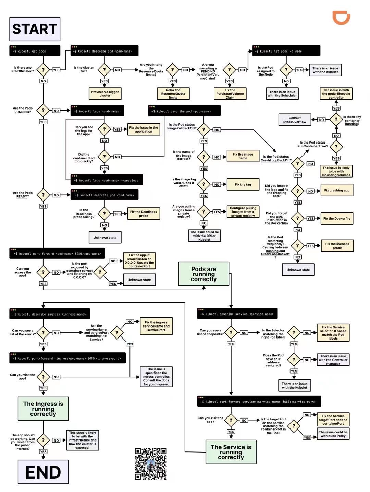

<a name="ZD5Li"></a>
## 通用命令
查看 kubernetes 资源的配置:
```bash
kubectl get <resource> <name> -n <namespace> -o yaml
```
修改 kubernetes 资源的配置:
```bash
kubectl edit <resource> <name> -n <namespace>
```
进入 pod:
```bash
kubectl exec -it <pod> -n <namespace> -- bash
```
删除无用的 replica:
```bash
kubectl delete replicaset $(kubectl get replicaset.apps -A | awk '$3==0{printf "%s -n %s\n",$2,$1}')
```
查看 Ingress-nginx 的 `nginx.conf`:
```bash
kubectl exec -it $(kubectl get pods -n gateway  | grep -E ^gateway | awk '{print $1}') -n gateway -- bash -c "cat /etc/nginx/nginx.conf" | less 
```



<a name="Sg5Z4"></a>
## K8S 集群网络链路

依次从内部到外测试网络链路是否畅通:<br />以  `overture-web-backend`  为例, api 代替某个具体的/api:

```bash
## 在backend的容器中
## localhost一定是通的
curl -XGET -ik http://localhost:8080/api

## 服务发现(Service discovery)的名字作为域名
curl -XGET -ik http://overture-web-backend/api

## 在前置ingress中
## 我司根据不同channel有不同的前置ingress
## `服务发现.命名空间`作为域名
curl -XGET -ik http://overture-web-backend.overture/api

## curl ingress所在的IP 同时带上host请求头
## 我司不同channel对应不同ingress 端口根据nginx来决定
curl -ik http://xxx.xxx.xxx.xxx:30003/api -H "Host: xxx.xxx.com"

## 外部配置DNS解析后在公网
curl -ik https://xxx.xxx.com/api
```

<a name="gzIoo"></a>
## 强制删除 namespace

登录 k8s-master 节点, 查看 namespace 是否已经是 `terminating` 的状态了.

```bash
kubectl get ns | grep xxxx
```

导出 namespace 的 json 数据.

```bash
kubectl get namespace xxxx -o json > xxxx.json
```

删除`spec`中的所有内容:

```bash
# 新开一个kubectl的代理
kubectl proxy --port=8081

# 调用finalize的api
curl -k -H "Content-Type: application/json" \
  -XPUT --data-binary @xxxx.json http://127.0.0.1:8081/api/v1/namespaces/xxxx/finalize
```

<a name="c3TLx"></a>
## crictl

```bash
crictl
```
