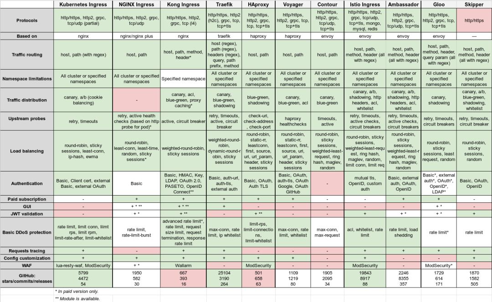

<a name="x2QMA"></a>
# Kubernetes Ingress Controller
参考文档：

- [Ingress 介绍 - Kubernetes 官方文档](https://kubernetes.io/docs/concepts/services-networking/ingress/)

Ingress 就是**入口**的意思，那么 Ingress Controller 就是入口控制器了。它为了解决 Kubernetes 集群上同一入口的负载均衡和路由转发。<br />通俗地来说，一般我们会在集群上创建应用并暴露端口与其通信，但 Kubernetes 的暴露方式只有 NodePort，每次暴露一个 NodePort 相当于在 Kubernetes 集群的网络边界上“挖了一个洞”。Ingress Controller 为我们做的事情就是：通过一个 LoadBalancer 来代理这个这个 NodePort 所有流量统一经过它。<br />Ingress Controller 有不同的实现方式，实现的功能也不尽相同：

- Kuberentes ingress
- NGINX Ingress
- HAproxy
- Traefik
- Gloo，等等。

这里我个人更加倾向于 Ingress-nginx，因为我个人更加熟悉 nginx 配置文件。<br />下表简单对照一下 Ingress 和传统 NGINX 部署的关系，对照不是那么的严格，理解大概意思即可：

| Ingress 部署在 Kubernetes 中 | 传统 NGINX 部署 |
| --- | --- |
| Ingress Controller | NGINX 实例 |
| Ingress | nginx.conf 中的监听和路由规则 |
| Service | iptables 或者 ipvs |

可以看下面的插图，解释的很非常通俗易懂：<br />
<a name="s30le"></a>
## Nginx Ingress Controller 安装步骤
参考文档：

- [NGINX Ingress Controller - Github](https://github.com/bitnami/charts/tree/master/bitnami/nginx-ingress-controller)
- [NGINX Ingress Controller - Values.yaml - Github](https://github.com/bitnami/charts/blob/master/bitnami/nginx-ingress-controller/values.yaml)
- [NGINX Ingress Controller ConfigMaps - NGINX Ingress Controller 官网](https://kubernetes.github.io/ingress-nginx/user-guide/nginx-configuration/configmap/)

使用 Helm 安装 Ingress Controller，注意安装后的提示信息。
```bash
helm repo add https://kubernetes.github.io/ingress-nginx
helm search repo ingress-nginx

kubectl create ns ingress-nginx

# 默认安装
helm install ingress-nginx bitnami/nginx-ingress-controller -n ingress-nginx
```
安装后会打印一段信息，提示如何安装示例：
```yaml
Release "ingress-nginx" has been upgraded. Happy Helming!
NAME: ingress-nginx
LAST DEPLOYED: Mon Feb 14 16:11:08 2022
NAMESPACE: ingress-nginx
STATUS: deployed
REVISION: 2
TEST SUITE: None
NOTES:
CHART NAME: nginx-ingress-controller
CHART VERSION: 9.1.5
APP VERSION: 1.1.1

** Please be patient while the chart is being deployed **

The nginx-ingress controller has been installed.

Get the application URL by running these commands:

 NOTE: It may take a few minutes for the LoadBalancer IP to be available.
        You can watch its status by running 'kubectl get --namespace ingress-nginx svc -w ingress-nginx-nginx-ingress-controller'

    export SERVICE_IP=$(kubectl get svc --namespace ingress-nginx ingress-nginx-nginx-ingress-controller -o jsonpath='{.status.loadBalancer.ingress[0].ip}')
    echo "Visit http://${SERVICE_IP} to access your application via HTTP."
    echo "Visit https://${SERVICE_IP} to access your application via HTTPS."

An example Ingress that makes use of the controller:

  apiVersion: networking.k8s.io/v1
  kind: Ingress
  metadata:
    name: example
    namespace: ingress-nginx
  spec:
    ingressClassName: nginx
    rules:
      - host: www.example.com
        http:
          paths:
            - backend:
                service:
                  name: example-service
                  port:
                    number: 80
              path: /
              pathType: Prefix
    # This section is only required if TLS is to be enabled for the Ingress
    tls:
        - hosts:
            - www.example.com
          secretName: example-tls

If TLS is enabled for the Ingress, a Secret containing the certificate and key must also be provided:

  apiVersion: v1
  kind: Secret
  metadata:
    name: example-tls
    namespace: ingress-nginx
  data:
    tls.crt: <base64 encoded cert>
    tls.key: <base64 encoded key>
  type: kubernetes.io/tls
```
配置一个自己的 Ingress 和 Service 就可以测试了。<br />调试的时候可以通过如下命令来查看 Ingress-nginx 的配置，如果服务发现配置成功, 可以在其中发现对应服务的配置。
```bash
kubectl get pods -n ingress-nginx
kubectl exec -it ingress-nginx-nginx-ingress-controller-57b6f9794f-zkzrj -n gateway \
  -- bash -c "cat /etc/nginx/nginx.conf"
```
<a name="bjIt3"></a>
## 相关配置
安装的时候已经介绍了一下 Ingress Controller 和其上匹配的默认配置，下面是 Ingress 的 YAML 中可配置的参数。
<a name="uoBy6"></a>
### Https 证书
需要配置 Https 证书。获得一下两个值,，这里是用 acme.sh 生成的自授权证书：<br />**方法1**
```bash
kubectl create secret tls leryn.top -n ingress-nginx \
  --cert '/etc/tls/leryn.top/fullchain.cer'   \
  --key  '/etc/tls/leryn.top/leryn.top.key'
```
**方法2**
```bash
# tls.crt
cat '/etc/tls/leryn.top/fullchain.cer' | base64 -w 0
# tls.key
cat '/etc/tls/leryn.top/leryn.top.key' | base64 -w 0
```
将上面的 `tls.crt`和 `tls.key`填入一下 yaml：
```bash
apiVersion: v1
kind: Secret
metadata:
  name: leryn.top
data:
  tls.crt: 
  tls.key: 
type: kubernetes.io/tls
```
```bash
kubectl apply -f leryn.top.yaml
```
更新 Ingress-controller，注意 configmap 的字段应当用重引号引用，确保值以字符串的类型传递，而不是在 bash 阶段就脱去引号，导致不正确的类型。
```bash
helm upgrade ingress-nginx bitnami/nginx-ingress-controller -n ingress-nginx \
  --set extraArgs.default-ssl-certificate="ingress-nginx/leryn.top" \
  --set extraArgs.ingress-class="nginx" \
  --set config.gzip-min-length="\"1024\"" \
  --set config.use-forwarded-headers="\"true\"" \
  --set config.use-gzip="\"true\"" \
  --set defaultBackend.enabled="false" \
  --set ingressClassResource.default="true" \
  --set service.nodePorts.http="30080" \
  --set service.nodePorts.https="30443" \
  --set service.type="NodePort"

helm install ingress-nginx ingress-nginx/ingress-nginx -n ingress-nginx \
  --set controller.extraArgs.ingress-class="nginx" \
  --set controller.extraArgs.default-ssl-certificate="ingress-nginx/leryn.top" \
  --set controller.config.use-gzip='"true"' \
  --set controller.config.gzip-min-length="1k" \
  --set controller.config.use-forwarded-headers='"true"' \
  --set defaultBackend.enabled="false"
```
<a name="gdDAi"></a>
### 路由规则
路由规则可以以 `annotations` 的方式添加到 Ingress 中：

- `ingress.kubernetes.io/ssl-redirect`: true，是否开启 SSL 重定向
- `nginx.ingress.kubernetes.io/proxy-body-size`: 1G，代理转发的请求体大小
- `nginx.ingress.kubernetes.io/ssl-redirect`: true，是否开启 SSL 重定向
- `nginx.ingress.kubernetes.io/rewrite-target`: `/$1`，如何重写转发路径
<a name="xeND1"></a>
### Ingress Class
如果一个集群上可以安装多个 Ingress Controller，例如通过不同的 Ingress Class 来区分不同的渠道：Admin Ingress，Internal Ingress等等，不同的渠道的认证、转发规则都不尽相同，内部认证可能基于 Cookies，外部认证基于 Token。<br />当创建新的 Ingress 时，可以通过为其指定 Ingress Class 的方式将其注入到预期的 Ingress Controller 中。如果不显式指定 Ingress Class，且集群中只有一个 Ingress Class 标记为默认，那么会自动应用到 Ingress 上。<br />早期版本使用注解来标记默认 Ingress Class，现在请使用 `spec.ingressClassName: "name"` 来指定。另外在 IngressClass 使用注解 `ingressclass.kubernetes.io/is-default-class: true` 来指定默认 Ingress Class。
<a name="emeOz"></a>
### 发布策略
参考文档:

- [k8s-deployment-strategies - Github](https://github.com/ContainerSolutions/k8s-deployment-strategies)
- [NGINX Ingress Controller Annotations for Canary - NGINX Ingress Controller 官网](https://kubernetes.github.io/ingress-nginx/user-guide/nginx-configuration/annotations/#canary)
- [ingress实现灰度发布 - CSDN](https://blog.csdn.net/zyl290760647/article/details/104640652/)
- [kubernetes基于nginx-ingress进行蓝绿部署、金丝雀发布（canary）- CSDN](https://blog.csdn.net/weixin_46754666/article/details/124832391?)

金丝雀规则按优先顺序进行如下排序：

- `nginx.ingress.kubernetes.io/canary-by-header`：基于 Request Header 的流量切分，适用于灰度发布以及 A/B 测试。当 Request Header 设置为 always时，请求将会被一直发送到 Canary 版本；当 Request Header 设置为 never时，请求不会被发送到 Canary 入口；对于任何其他 Header 值，将忽略 Header，并通过优先级将请求与其他金丝雀规则进行优先级的比较。
- `nginx.ingress.kubernetes.io/canary-by-header-value`：要匹配的 Request Header 的值，用于通知 Ingress 将请求路由到 Canary Ingress 中指定的服务。当 Request Header 设置为此值时，它将被路由到 Canary 入口。该规则允许用户自定义 Request Header 的值，必须与上一个 annotation (即：canary-by-header）一起使用。
- `nginx.ingress.kubernetes.io/canary-by-header-pattern`：他会让带有给定模式 Request Header 的流量进入金丝雀规则。
- `nginx.ingress.kubernetes.io/canary-by-cookie`：基于 Cookie 的流量切分，适用于灰度发布与 A/B 测试。用于通知 Ingress 将请求路由到 Canary Ingress 中指定的服务的cookie。当 cookie 值设置为 always时，它将被路由到 Canary 入口；当 cookie 值设置为 never时，请求不会被发送到 Canary 入口；对于任何其他值，将忽略 cookie 并将请求与其他金丝雀规则进行优先级的比较。
- `nginx.ingress.kubernetes.io/canary-weight`：基于服务权重的流量切分，适用于蓝绿部署，权重范围 0 - 100 按百分比将请求路由到 Canary Ingress 中指定的服务。权重为 0 意味着该金丝雀规则不会向 Canary 入口的服务发送任何请求。权重为 100 意味着所有请求都将被发送到 Canary 入口。

