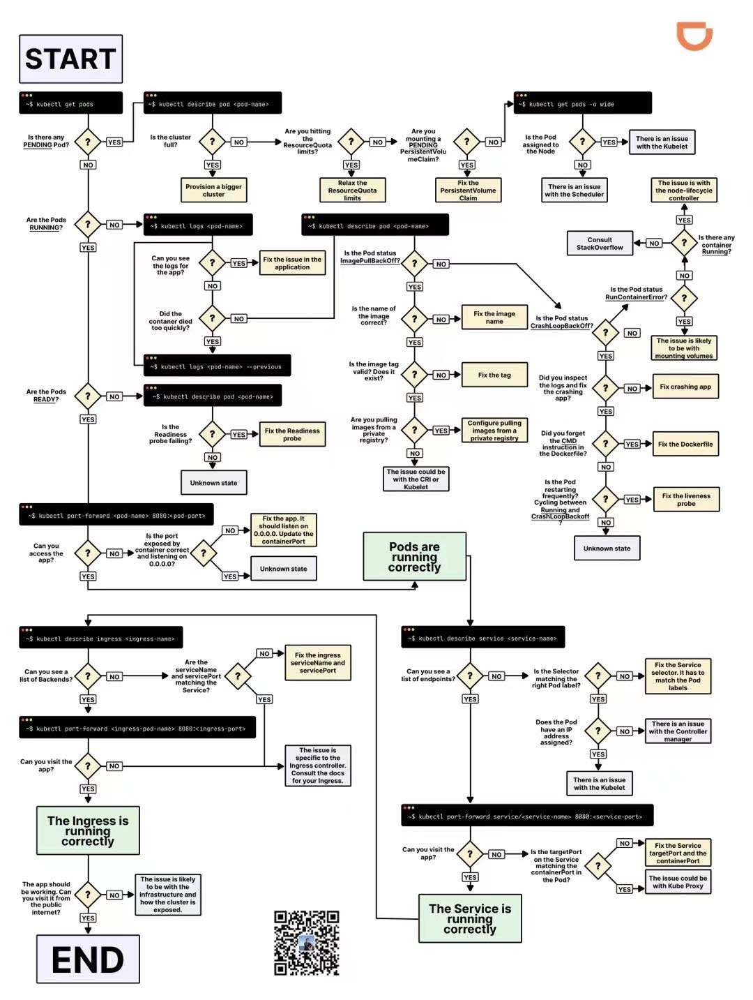

<a name="ZD5Li"></a>
## Kubectl 通用命令

Kubectl 很多命令和 docker 是通用的, 无非是增加 `-n <namespace>` 这个参数:

```bash
# 进入 pod
kubectl exec -it <pod> -n <namespace> -- bash

# 查看 pod 日志
kubectl log -f <pod> -n <namespace>
```

其他命令也很通俗易懂, 总体而言以下几种命令使用频率比较高:

```bash
# 查看 kubernetes 资源的配置:
kubectl get <resource> <name> -n <namespace> -o yaml

# 修改 kubernetes 资源的配置
kubectl edit <resource> <name> -n <namespace>

# 删除无用的 replica
kubectl delete replicaset $(kubectl get replicaset.apps -A | awk '$3==0{printf "%s -n %s\n",$2,$1}')
```

一个更加复杂的例子, 比如查看 Ingress-nginx 的 `nginx.conf`:

```bash
kubectl exec -it $(kubectl get pods -n gateway  | grep -E ^gateway | awk '{print $1}') \
  -n ingress-nginx -- bash -c "cat /etc/nginx/nginx.conf" | less 
```


<a name="Sg5Z4"></a>
## K8S 集群网络链路

依次从内部到外测试网络链路是否畅通:<br />以  `overture-web-backend`  为例, api 代替某个具体的/api:

```bash
## 在backend的容器中
## localhost一定是通的
curl -XGET -ik http://localhost:8080/api

## 服务发现(Service discovery)的名字作为域名
curl -XGET -ik http://overture-web-backend/api

## 在前置ingress中
## 我司根据不同channel有不同的前置ingress
## `服务发现.命名空间`作为域名
curl -XGET -ik http://overture-web-backend.overture/api

## curl ingress所在的IP 同时带上host请求头
## 我司不同channel对应不同ingress 端口根据nginx来决定
curl -ik http://xxx.xxx.xxx.xxx:30003/api -H "Host: xxx.xxx.com"

## 外部配置DNS解析后在公网
curl -ik https://xxx.xxx.com/api
```

<a name="gzIoo"></a>
## 
