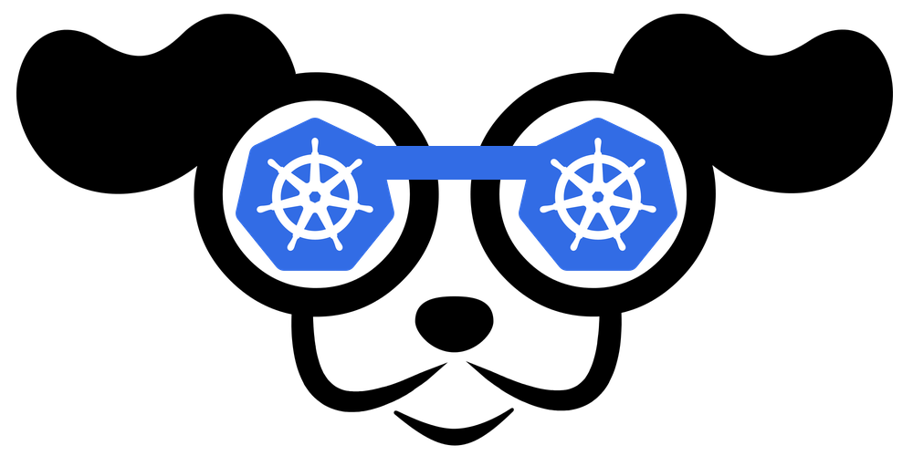
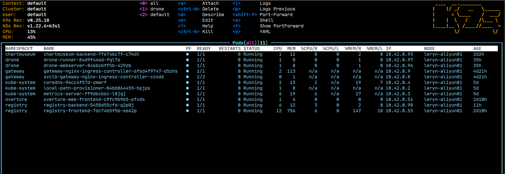

# Kubernetes UI

## K9S
<br />参考文档：

- [GitHub - derailed/k9s: 🐶 Kubernetes CLI To Manage Your Clusters In Style!](https://github.com/derailed/k9s)
:::info
**K9S - Kubernetes CLI To Manage Your Clusters In Style!**
:::
非常还用的 Kubernetes 命令行管理工具，涵盖了所有 Kubernetes 的管理功能。<br />如果用习惯了之后就会像 vim 一样顺手，比 Web UI 更加快速和易于操作。
```bash
wget https://github.com/derailed/k9s/releases/download/v0.25.18/k9s_Linux_x86_64.tar.gz

tar -xf *.tar.gz

sudo mv $PWD/k9s /usr/local/bin

# 启动即可
k9s
```
K9S 也非常适合二次开发，你可以为你常用的功能编写插件，或者 fork 仓库二次开发。例如，我为 K9S 增加了管理 Harbor 实例和项目的功能，可以查找 Harbor 上的镜像和 Chart。<br />

## Rancher 

# 
参考文档：

- [Rancher文档 | K8S文档 | Rancher | Rancher文档](https://docs.rancher.cn/docs/rke/%E5%AE%89%E8%A3%85%E6%AD%A5%E9%AA%A4/_index)

Rancher 自带了一套 k3s 单机。实际使用下来，性能要求略高于裸机 k3s。如果是开发或者个人建站使用，更推荐使用 k3s。<br />我司生产上在两台超融合上的虚拟机使用 RKE 安装 Rancher，作为管理界面管理多套 k8s 集群。因此这是一个生产级的应用，包括内置了 Rancher Pipeline（用起来真是世界上安装最简单的 CI）。

### 安装步骤 using Docker
安装 rancher 镜像，然后打开网页初始化 Rancher

- v2.3.1 // 公司生产版本
- v2.5.11 // 当前比较新的稳定版本
- v2.6.2 // 2.6 版本的全新
```bash
docker run \
  --detach=true \
  --privileged \
  --publish=8442:80 \
  --publish=8443:443 \
  --restart=always \
  --volume=/data/rancher:/var/lib/rancher \
  --name=rancher \
  --hostname=rancher \
  rancher/rancher:v2.5.11
```
v2.6 以下首次登录需要密码，根据提示设置新的管理员密码。<br />v2.6 以上需要用如下命令查看：
```bash
docker logs rancher 2>&1 | grep "Bootstrap Password:"
```
直接访问 `https://xxx.xxx.xxx.xxx:8443` 即可。

### 安装步骤 using Helm
以下是在公司中使用 helm 安装的步骤：
```bash
helm install rancher rancher-stable/rancher \
  --namespace cattle-system \
  --set hostname=rancher.mydomain.com \
  --set ingress.tls.source=secret \
  --set replicas=1
```

### Rancher导入集群
打开 rancher 界面，点击 `import generic`，设定好集群名，Rancher 临时生成一段 YAML。这段 YAML 在待托管的 Kubernetes master 节点上执行即可，它会为新集群安装 Rancher 的探针和 Agent。<br />导入集群：
```bash
kubectl apply -f https://xxx.xxx.xxx.xxx:8443/v3/import/2fc8tn8vw7ccf96mqx5tcjkjb6wbt7kpgvmlslrjqx9w4x5k5z85h9_c-m-fpgbd5zd.yaml
```
如果 Rancher 没有安全的HTTPS证书：
```bash
curl --insecure -sfL https://xxx.xxx.xxx.xxx:8443/v3/import/2fc8tn8vw7ccf96mqx5tcjkjb6wbt7kpgvmlslrjqx9w4x5k5z85h9_c-m-fpgbd5zd.yaml | kubectl apply -f -
```
如果有错误，那么使用这个命令：
```bash
kubectl create clusterrolebinding cluster-admin-binding --clusterrole cluster-admin --user <your username from your kubeconfig>
```

### 常见运维问题

#### Webhook 证书过期
参考文档：

- [Rotation of Expired Webhook Certificates | Rancher](https://rancher.com/docs/rancher/v2.6/en/troubleshooting/expired-webhook-certificates/)
- [How to rotate cattle-webhook-tls certificate when it has expired? · Issue #35068 · rancher/rancher](https://github.com/rancher/rancher/issues/35068)

Rancher 内部的 API 证书默认有效期一年，用了一年后会发生 webhook 过期的导致一部分功能无法使用，比如创建用户。那么可以删除该 secret，再重启 pod 来实现功能。
```bash
kubectl delete secret -n cattle-system cattle-webhook-tls

# kubectl delete mutatingwebhookconfigurations.admissionregistration.k8s.io --ignore-not-found=true rancher.cattle.io
kubectl delete pod -n cattle-system -l app=rancher-webhook
```

#### Serving-cert 证书过期
参考文档：

- [serving-cert expired · Issue #32210 · rancher/rancher](https://github.com/rancher/rancher/issues/32210)

如果使用 Rancher 2.5+ 的话，`serving-cert` 证书过期是不要紧的。
> This is legacy and is no longer needed/used assuming you are running rancher 2.5+ so it's fine if it expires


## Kubernetes-Dashboard
参考文档：

- [Kubernetes 仪表盘 | Rancher文档](https://docs.rancher.cn/docs/k3s/installation/kube-dashboard/_index)
- [Deploy and Access the Kubernetes Dashboard](https://kubernetes.io/docs/tasks/access-application-cluster/web-ui-dashboard/)
```bash
kubectl proxy --address='0.0.0.0' --accept-hosts='^*$'
```

## Kuboard
参考文档：

- [安装 Kuboard v2 - Kuboard 中文站](https://kuboard.cn/install/install-dashboard.html)

这是一个国产免费的 Kubernetes 控制面板。目前已经更新到 v3 版本，v2 处于长期支持版本。这里使用 v2 版本即可。<br />非常强大的 Kubernetes UI，但是个人界面上的元素过于多，面板花哨。

### 安装步骤
```bash
kubectl apply -f https://kuboard.cn/install-script/kuboard.yaml
# kubectl apply -f https://addons.kuboard.cn/metrics-server/0.3.7/metrics-server.yaml
```
查看 Kuboard 运行状态：
```bash
kubectl get pods -l k8s.kuboard.cn/name=kuboard -n kube-system
```
输出结果如下所示：
```bash
NAME                       READY   STATUS        RESTARTS   AGE
kuboard-54c9c4f6cb-6lf88   1/1     Running       0          45s
```

### 获取Token
您可以获得管理员用户，只读用户的Token。我这里只使用管理员用户：

- 此 Token 拥有 ClusterAdmin 的权限, 可以执行所有操作
```bash
# 如果您参考 www.kuboard.cn 提供的文档安装 Kuberenetes，可在第一个 Master 节点上执行此命令
echo $(kubectl -n kube-system get secret $(kubectl -n kube-system get secret | grep ^kuboard-user | awk '{print $1}') -o go-template='{{.data.token}}' | base64 -d)
```
取输出信息中 token 字段，下步要使用。Kuboard Service 使用了 NodePort 的方式暴露服务，NodePort 为 32567，您可以按如下方式访问 Kuboard：`http://xxx.xxx.xxx.xxx:32567/`<br />输入前一步骤中获得的 token，可进入 **Kuboard 集群概览页**。
