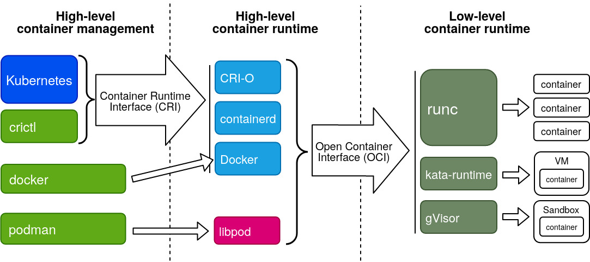

# 容器运行时
参考文档：

- [梳理一下 Windows 的 Hyper-V、Hypervisor](https://zhuanlan.zhihu.com/p/381969738)

聊容器运行时之前，先聊一下两个话题：

- 为什么要隔离？
- 有哪几哪些隔离级别？

聊完再介绍容器运行时的两个概念 OCI 和 CRI。

### 为什么要隔离

- 安全隔离：不同用户、不同信任域
- 性能隔离：避免应用间资源挤兑
- 故障隔离：合理划分故障域，减小爆炸半径
- 配置隔离：支持多版本、多配置

### 隔离级别
隔离级别，隔离能力从低到高有以下五种：

- 语言运行时隔离：通过语言的运行时提供沙箱，例如 JVM 和 Node.js
- 进程隔离：服务运行在不同进程之中
- OS 虚拟化：在同一 OS 中构建相对隔离能力的环境，例如 Linux namespace 和 cgroup
- 硬件虚拟化：基于硬件辅助的服务器虚拟化，创建虚拟机方式来隔离
- 硬件分区：从硬件平台隔离硬件资源，已经式微的模式

隔离能力的提升，相反会带来资源冗余和维护成本<br />

### OCI：Low-level 容器运行时
OCI（Open Container Initiative）是开发容器标准。它是由各个容器公司倡议形成的开放的行业标准，可以底层实现不同的平台、不同的操作系统上运行容器，但需要遵守行业标准。<br />OCI 涵盖了三个标准：

- **runtime-spec**：它主要负责容器如何创建和运行、如何和宿主机交互。
- image-spec：镜像如何组成的。
- distribution-spec：镜像如何分发、镜像库的 API。

主要有这几种：

- runc：轻量级低级容器运行时，由 go 语言实现，基于 Linux namespace 和 cgroup 的实现。它也是 docker 底层的运行时
- runv & kata-containers：轻量级虚拟机，基于虚拟机实现。
- cri-o：
- crun：用纯 C 实现的 runc
- gVisor：拥有自己的内核，运行时模拟出 linux 内核 syscall 调用
- runnc：
- runhcs：Windows 系统独有的 Windows server container 机制和 Hyper-V containers 机制。虽然 Windows 操作系统臃肿和生态问题导致它很小众，但它架构反而非常优秀。

### CRI：High-level 容器运行时
CRI（Container Runtime Interface）是 Kubernetes 官方提出的接口标准，<br />广义的容器运行时有很多，包括但不限于以下：

- Docker
- Containerd
- Podman
- Kata-container
- NVIDIA Containerd （GPU 特供）

但是常提还是特指 Docker 和 Containerd<br />随着 OCI 的提出和厂商对隔离性的要求，除了用宿主机的进程隔离策略，现在有厂商提供基于虚拟机的容器方案，例如 Podman 在 MacOS 上提供基于 QEMU 的容器，Google 提出的 gVisor 等等。<br />


## nerdctl & buildkit
nerdctl 旨在为 containerd 提供那些从 docker 中裁剪掉的功能。本身 runc 的 ctr 和 containerd 的 crictl 非常难使用，因为它们只提供了最基本的功能。nerdctl 的出现解决了这点。<br />如果需要完全替代 docker，nerdctl 还需要能构建镜像。但是 crictl 和 nerdctl 本身不支持构建，需要再额外安装一个 buildkitd 来作为 daemon 服务提供构建镜像的能力。<br />安装 nerdctl：
```bash
VERSION=1.7.3
wget https://github.com/containerd/nerdctl/releases/download/v${VERSION}/nerdctl-${VERSION}-linux-amd64.tar.gz

tar -xf nerdctl-${VERSION}-linux-amd64.tar.gz

sudo mv nerdctl /usr/local/bin/nerdctl
sudo chmod a+x /usr/local/bin/nerdctl
```
```bash
alias docker='nerdctl --namespace=k8s.io  --address=unix:///run/k3s/containerd/containerd.sock '
```
安装 buildkit 和 buildkitd：
```bash
VERSION=v0.12.5
wget https://github.com/moby/buildkit/releases/download/${VERSION}/buildkit-${VERSION}.linux-amd64.tar.gz

tar -xf buildkit-${VERSION}.linux-amd64.tar.gz

sudo mv bin/* /usr/local/bin/
sudo chmod a+x /usr/local/bin/build*
```
配置 systemd 文件：
```toml
[Unit]
Description=BuildKit
Documention=https://github.com/moby/buildkit
 
[Socket]
ListenStream=%t/buildkit/buildkitd.sock
 
[Install]
WantedBy=sockets.target
```
```toml
[Unit]
Description=BuildKit
Require=buildkit.socket
After=buildkit.socket
Documention=https://github.com/moby/buildkit
 
[Service]
ExecStart=/usr/local/bin/buildkitd --oci-worker=false --containerd-worker=true
 
[Install]
WantedBy=multi-user.target
```
```bash
sudo systemctl daemon-reload
sudo systemctl enable  buildkitd
sudo systemctl restart buildkitd
sudo systemctl status  buildkitd
```
