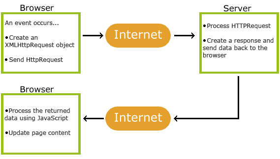

# AJAX
参考文档：

- [AJAX Introduction](https://www.w3schools.com/xml/ajax_intro.asp)

AJAX 是 Asynchronous JavaScript And XML 的首字母缩写~~_（并不是球队）_~~，它的名字充满了误导性，实际上它不止使用 XML 来传输数据，也可以是 JSON 或者纯文本等等。
它不是一种编程语言或者某个具体依赖库，而是一种编程技术（的组合）：

- 浏览器内置的 XMLHttpRequest 对象，从 Web 服务器请求数据
- JavaScript 和 HTML DOM

以上两者的结合可以实现浏览器和服务端传输数据来异步更新页面，这意味了用户不在需要重新加载整个页面就可以更新局部页面。



# Axios
Axios 基于 XHR API（XMLHttpRequest）而不是 Fetch API 的 HTTP Client 库，它轻量化的封装了 XHR。它是目前比较风靡的 HTTP Client 库，许多前端项目都使用二次封装的 axios 作为 HTTP 请求库。
Axios 请求时：后端 Spring 注解`@RequestBody`，`@RequestParam`对应的用法。
```javascript
let data = {
  username: "root",
  password: "123456",
};

axios
  .post("/api", qs.stringify(data))
  .then((response) => {
    console.log(response);
  });

axios
  .post("/api", data)
  .then((response) => {
    console.log(response);
  });
```
