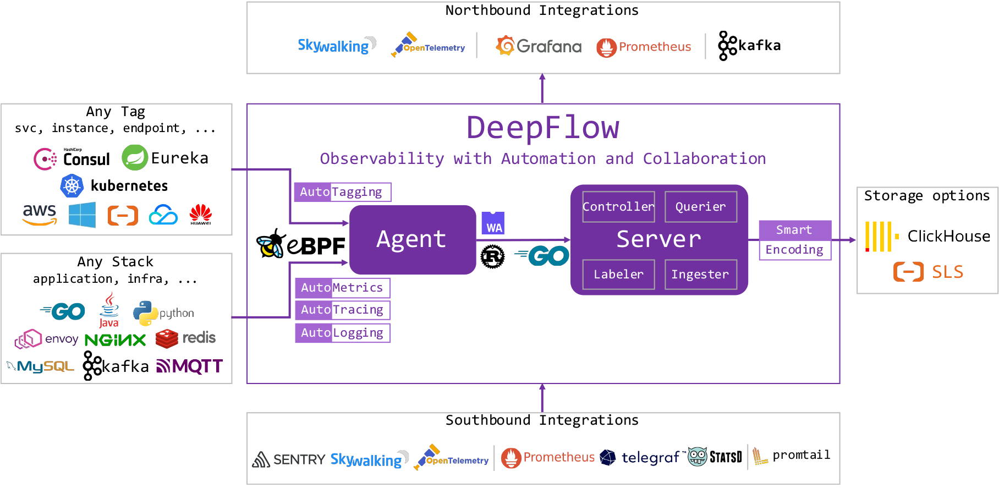

参考文档：

- [https://deepflow.io/docs/zh/about/overview/](https://deepflow.io/docs/zh/about/overview/)

基于 eBPF 的监控全链路监控、无需插点，支持任何语言和协议。<br />Server 端必须在 Kubernetes 集群中，agent 可以在同一集群中、不同 Kubernetes 集群、物理机上，监控数据由 agent 向宿主机上报。<br />版本对比：

- 商业版和社区版的后端是一致的
- 商业版的 UI 是独立的，社区版是基于 Grafana 的图表

Deepflow 架构图：<br />

<a name="Q1g0P"></a>
## 单集群
需要一个 MySQL，一个 Clickhouse
```bash
# 创建EBS默认StorageClass
kubectl apply -f https://openebs.github.io/charts/openebs-operator.yaml
kubectl patch storageclass openebs-hostpath  -p '{"metadata": {"annotations":{"storageclass.kubernetes.io/is-default-class":"true"}}}'

helm repo add deepflow https://deepflowio.github.io/deepflow
# 阿里云加速
helm repo add deepflow https://deepflow-ce.oss-cn-beijing.aliyuncs.com/chart/stable
helm repo update deepflow

# 用 Helm 安装
helm install deepflow -n deepflow deepflow/deepflow --create-namespace \
    -f values-custom.yaml

# 安装 deepflow-ctl 命令行工具 安装在
curl -o /usr/bin/deepflow-ctl https://deepflow-ce.oss-cn-beijing.aliyuncs.com/bin/ctl/stable/linux/$(arch | sed 's|x86_64|amd64|' | sed 's|aarch64|arm64|')/deepflow-ctl
chmod a+x /usr/bin/deepflow-ctl
```
<a name="dsh1W"></a>
## 跨集群
部署 agent
```bash
unset CLUSTER_NAME
CLUSTER_NAME="k8s-1"  # FIXME: K8s cluster name
cat << EOF | deepflow-ctl domain create -f -
name: $CLUSTER_NAME
type: kubernetes
EOF

deepflow-ctl domain list $CLUSTER_NAME  # Get K8sClusterID
```
```bash
cat << EOF > values-custom.yaml
deepflowServerNodeIPS:
- 10.1.2.3  # FIXME: K8s Node IPs
- 10.4.5.6  # FIXME: K8s Node IPs
clusterNAME: k8s-1  # FIXME: name of the cluster in deepflow
EOF
```
```bash
helm repo add deepflow https://deepflowio.github.io/deepflow
helm repo update deepflow # use `helm repo update` when helm < 3.7.0
helm install deepflow-agent -n deepflow deepflow/deepflow-agent --create-namespace \
    -f values-custom.yaml
```
<a name="mKmoM"></a>
#### 常见问题
目前测试多网卡设配时，deepflow 会默认选择第一块网卡。如果需要调整网卡，请修改这几个表中的 IP，并重启 server 和 agent。
```sql
select * from controller;
select * from analyzer;
select * from az_controller_connection;
select * from az_analyzer_connection;
select * from vtap;
```
