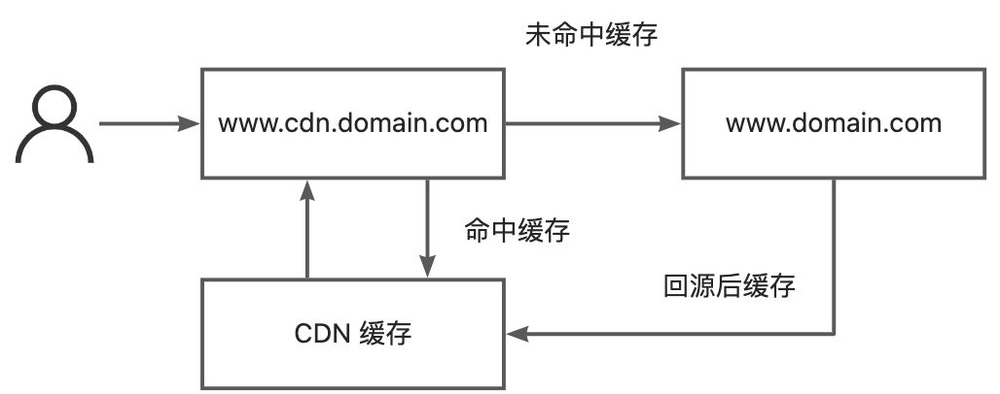

# CDN（Content Delivery Network）
CDN（Content Delivery Network），全称是内容分发网络。顾名思义，它是专门用于内容分发的网络，加速不同地域或地区用户访问的专用网络。

## 背景
对于后端来说，由于磁盘 IO 的限制，为了避免后端服务频繁查询数据库，常见的做法是在应用和数据库之间加入一层缓存层 Redis。每次读取数据库之后，将查询结果暂存到 Redis 中，下次查询如果数据库没有更新的话，直接到 Redis 中读取上一次的值即可。

如果现在的场景变成了静态文件：一张图片、一个 JS 脚本、一段 CSS 样式，我们也可以加入一个类似的缓存层在客户端和存储层之间，CDN 就承担了这个角色。有了 CDN 之后，前段访问静态资源就会将最近访问过的资源缓存到 CDN。

## 边缘节点
CDN 会根据客户端请求的 IP 信息，将文件缓存的到距离客户端最近的网络节点（也就是边缘节点）上，下一次访问时，客户只需要访问最近节点上的缓存即可。例如一个服务器部署在上海数据中心的公司，而北京的客户需要访问这个服务器上的静态文件，需要经过非常长的网络链路，可能需要几百毫秒的延迟，这对用户是不可接受的。但是 CDN 供应商商会将数据就近缓存到北京的 CDN 节点上，客户的访问速度就会提高，访问延迟可能缩短到十几到几十毫秒。

所以只有在各个地域或地区都有专用数据中心提供服务的供应商才有提供 CDN 服务基本的硬件条件。普通的企业或个人，一部份企业可以做到两地三中心异地容灾，但大部分都无法做到各地都有数据中心。而 CDN 供应商会在全国很多大区都有自建的数据中心，有的服务器直接入驻当地运营商的租赁机房，这些节点都作为边缘节点，才为 CDN 提供可能。

CDN 供应商会将 CDN 域名，例如 www.cdn.domain.com，解析到另一个 CNAME，这个 CNAME 会在 CDN 专用的 DNS 服务器返回距离用户最近的 IP 信息，这些任务都由 CDN 供应商提供。

## 回源
首次访问 CDN 内容时，CDN 上是没有缓存的。所以首次访问需要回源，即去真正提供内容的服务加载文件。这意味着首次访问 CDN 会比没有 CDN 还要慢一些（如果访问源站的网络比较差的话，也不一定会比没有 CDN 慢）。

回源这件事本身对用户是无感的，正常使用的用户是无法感知到 CDN 是否发生了回源。

#### 判断回源
但是我们也可以从请求头来判断是否命中 CDN 缓存，例如阿里云 CDN 会在响应中携带请求头 `X-Cache`，如果请求头是 `TCP MISS`，则说明该请求没有命中缓存，反之请求头是 `TCP Mmemory HIT`，则说明该请求命中了缓存。不同的 CDN 厂商的请求头可能不同。

#### 刷新预热
这常见在生产部署时：

+ 静态资源内容更新了，但是没有更新文件地址：客户端访问仍然会访问 CDN 上的缓存，而不是变化后的内容。
+ 新服务上线：CDN 上没有缓存时，大量客户端涌入直接访问存储，导致存储负载突然升高。

这时需要使用 CDN 供应商提供的刷新预热接口来刷新 CDN 缓存，避免以上场景的发生。

