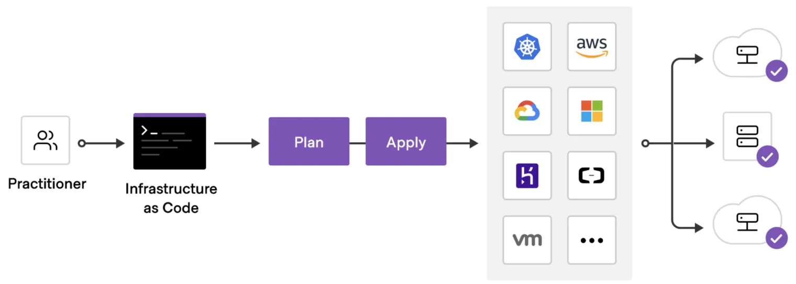
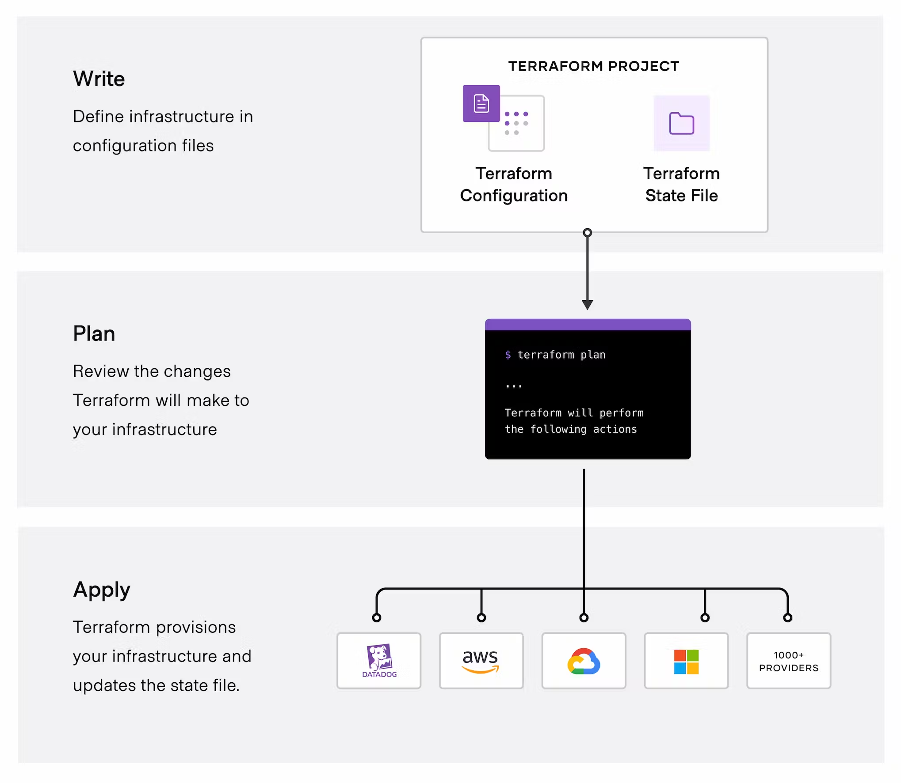
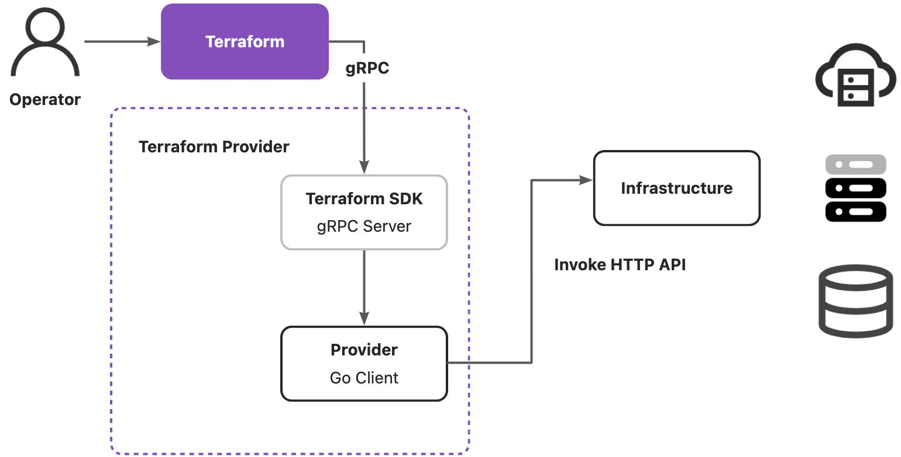

# Terraform


## 介绍
Terraform 有 Hashicorp 公司开发，可以通过第三方厂商提供的插件，结合 HCL 配置文件来声明式的自动化部署基础设施。这里的基础设施可以是：云服务器、操作系统、存储、 Kubernetes 资源、中间件等等。
常见的云厂商都有提供自己平台的插件：

- 国内公有云：阿里云、腾讯云
- 国外公有云：AWS、Google Cloud、Azure
- 虚拟化厂商：VMWare、SmartX
- Kubernetes

Terraform 有几个概念：

- Provider：Terraform 的最核心的概念，它是由第三方厂商提供的二进制插件。
- Resource：对应了厂商给出的基础设施资源。
- DataSource：获得基础设施资源配置的数据源。



Terraform 执行分成三个步骤：

- Write：编写配置文件来定义资源和设置配置参数。
- Plan：生成基础设施执行计划，包括显式指定或者资源类型隐式蕴含的依赖关系。
- Apply：真正的执行基础设施的变更。




## 安装手册
在 MacOS 上安装：
```bash
brew install terraform
```
编写一个目录：
```
project
├── main.tf
├── provider.tf
└── version.tf
```


## 开发手册
参考文档：

- [GitHub - hashicorp/terraform-plugin-sdk: Terraform Plugin SDK enables building plugins (providers) to manage any service providers or custom in-house solutions](https://github.com/hashicorp/terraform-plugin-sdk)
- [GitHub - hashicorp/terraform-plugin-framework: A next-generation framework for building Terraform providers.](https://github.com/hashicorp/terraform-plugin-framework)
- [Implement a provider with the Terraform Plugin Framework | Terraform | HashiCorp Developer](https://developer.hashicorp.com/terraform/tutorials/providers-plugin-framework/providers-plugin-framework-provider)
- [Plugin Development - Debugging Providers | Terraform | HashiCorp Developer](https://developer.hashicorp.com/terraform/plugin/debugging)

如果需要集成一个新的的 Terraform Provider，使用 Terraform Plugin SDK 套件来开发，有两个可选套件，选择其一即可：

- [terraform-plugin-sdk](https://github.com/hashicorp/terraform-plugin-sdk)：SDK v2，现存大量的 Provider 都基于这套 SDK 开发。
- [terraform-plugin-framework](https://github.com/hashicorp/terraform-plugin-framework)：重新设计的 Plugin 开发套件，设计更加优雅，更加易于扩展。

如果选择新开发的 Provider，不是增强原有 Provider，推荐使用后者。
```bash
# SDK 2.0
go get github.com/hashicorp/terraform-plugin-sdk

# 重新设计的 framework
go get github.com/hashicorp/terraform-plugin-framework
```


