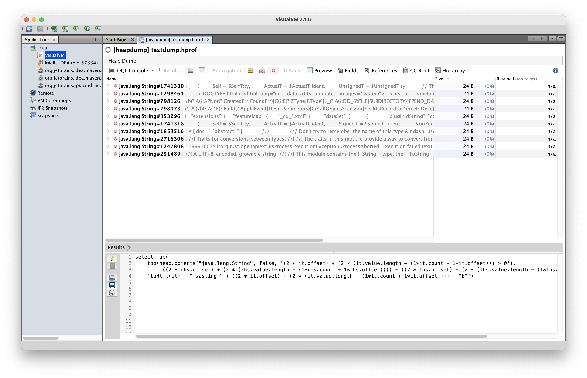
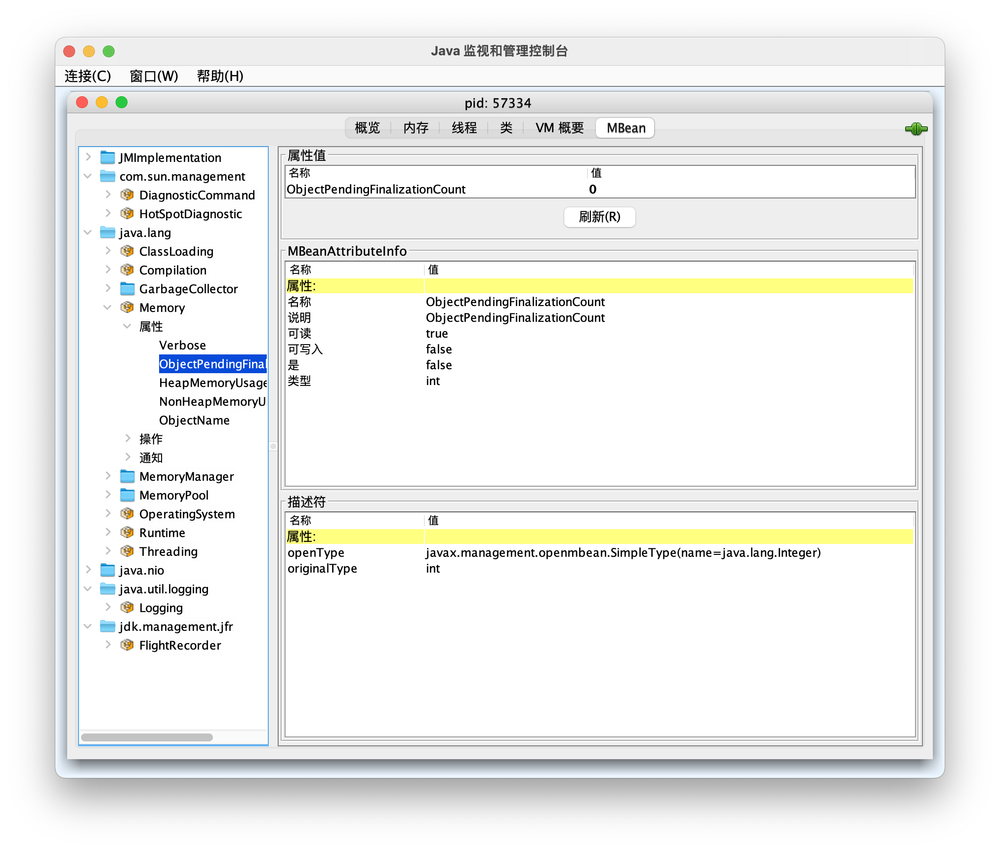

## JVM 原生工具

JDK 提供了一个查看堆栈的工具 jstack：
```bash
ps -ef | grep java | grep -v grep | awk '{print $2}' | xargs jstack
```
jmap 可以 dump 出一份 hprof 的文件：
```properties
jmap -dump:format=b,file=/Users/xxxx/Desktop/testdump.hprof <PID>
```
需要先安装 [VisualVM](https://visualvm.github.io/)，JDK 8 早版本或者是 Windows 版本会在安装时一同安装这个应用，其他系统需要单独安装。然后拖到 VisualVM里，即可：<br />

## JMX Exporter
参考文档：

- [jmx exporter - GitHub](https://github.com/prometheus/jmx_exporter)

我们需要在追加一个 `javaagent` 的参数：
```bash
java \
  -javaagent:/usr/local/jmx/jmx_prometheus_javaagent-0.16.1.jar=8081:/opt/jmx-config.yaml
  -jar app.jar
```

### Kubernetes 非侵入性方案
我们在 Kubernetes 运维的时候有一个非侵入性的解决方案：

- 应用的镜像是开发已经打包好的, 我们不会对其做出修改

假设 Dockefile 里提供了这个 entrypoint：
```dockerfile
ENTRYPOINT exec java $JAVA_OPTS -jar app.jar

# 或者有人是这么写也可以

CMD ["/bin/bash", "-c", "find -type f -name '*.jar' | xargs java $JAVA_OPTS -jar "]
```
那么我们就可以利用 `JAVA_OPTS` 做文章, 把替换成 `JAVA_OPTS` 我们的参数
```yaml
env:
- name: JAVA_OPTS
    value: "-javaagent:/usr/local/jmx/jmx_prometheus_javaagent-0.16.1.jar=8081:/opt/jmx-config.yaml -Dserver.tomcat.mbeanregistry.enabled=true"
```
然后我们开始挂载：

- 把 `jmx_prometheus_javaagent-0.16.1.jar` 用 PV 挂载到 `/usr/local/jmx/`
- 把 `jmx-config.yaml` 用 ConfigMap 挂载到 `/opt/jmx-config.yaml`
- SpringBoot Web 项目在配置文件中开启 `server.tomcat.mbeanregistry.enabled=true` 启用 Tomcat 的监控配置
```yaml
          volumeMounts:
            - name: jmx-exporter-volume
              subPath: .
              mountPath: /usr/local/jmx/
              readOnly: true
            - name: jmx-config-volume
              subPath: jmx-config.yaml
              mountPath: /opt/jmx-config.yaml
              readOnly: true
      volumes:
        - name: jmx-exporter-volume
          persistentVolumeClaim:
            claimName: jmx-exporter-pvc
        - name: jmx-config-volume
          configMap:
            name: jmx-configmap
```
其中 `jmx-config` 就是配置文件的对应的 ConfigMap，具体的指标采集模式可以参考 `jconsole` 中的 MBean (MBean 看下文介绍) ：
```yaml
apiVersion: v1
kind: ConfigMap
metadata:
  name: jmx-configmap
data:
  jmx-config.yaml: |-

    lowercaseOutputLabelNames: true
    lowercaseOutputName: true
    rules:
    - pattern: 'Catalina<type=GlobalRequestProcessor, name=\"(\w+-\w+)-(\d+)\"><>(\w+):'
      name: tomcat_$3_total
      labels:
        port: "$2"
        protocol: "$1"
      help: Tomcat global $3
      type: COUNTER
    - pattern: 'Catalina<j2eeType=Servlet, WebModule=//([-a-zA-Z0-9+&@#/%?=~_|!:.,;]*[-a-zA-Z0-9+&@#/%=~_|]), name=([-a-zA-Z0-9+/$%~_-|!.]*), J2EEApplication=none, J2EEServer=none><>(requestCount|maxTime|processingTime|errorCount):'
      name: tomcat_servlet_$3_total
      labels:
        module: "$1"
        servlet: "$2"
      help: Tomcat servlet $3 total
      type: COUNTER
    - pattern: 'Catalina<type=ThreadPool, name="(\w+-\w+)-(\d+)"><>(currentThreadCount|currentThreadsBusy|keepAliveCount|pollerThreadCount|connectionCount):'
      name: tomcat_threadpool_$3
      labels:
        port: "$2"
        protocol: "$1"
      help: Tomcat threadpool $3
      type: GAUGE
    - pattern: 'Catalina<type=Manager, host=([-a-zA-Z0-9+&@#/%?=~_|!:.,;]*[-a-zA-Z0-9+&@#/%=~_|]), context=([-a-zA-Z0-9+/$%~_-|!.]*)><>(processingTime|sessionCounter|rejectedSessions|expiredSessions):'
      name: tomcat_session_$3_total
      labels:
        context: "$2"
        host: "$1"
      help: Tomcat session $3 total
      type: COUNTER
```
成功后可以获得数据：
```bash
curl -XGET http://localhost:8081/metrics
```

## jconsole & cjmx
参考文档：

- [jconsole - OpenJDK 官网](http://openjdk.java.net/tools/svc/jconsole/)
- [jconsole - Java Monitoring and Management Console - Oracle 官网](https://docs.oracle.com/javase/6/docs/technotes/tools/share/jconsole.html)
- [cjmx/cjmx - GitHub](https://github.com/cjmx/cjmx)
- [cjmx_2.12-2.8.1-app.jar - 下载地址](https://search.maven.org/remotecontent?filepath=com/github/cjmx/cjmx_2.12/2.8.1/cjmx_2.12-2.8.1-app.jar)

`jconsole` 需要 GUI 才能运行，否则命令行会无反应。
```bash
jconsole <PID> | <HOST>:<PORT> | <JMX_SERVICE_URL>

jps | grep YourApplicationName  | awk '{print $1}' | xargs jconsole
```


如果你在线服务器没有 GUI，事实上绝大数情况都是这样，那可以使用这个 cjmx 的 jar 包来运行命令行风格的 jconsole：
```bash
java -cp /usr/lib/jvm/java-8-openjdk-amd64/lib/tools.jar:/root/cjmx_2.12-2.8.1-app.jar cjmx.Main <PID>

# or 或者

PID=$(jps | grep XXX | awk '{print $1}') && java -cp /usr/lib/jvm/java-8-openjdk-amd64/lib/tools.jar:/root/cjmx_2.12-2.8.1-app.jar cjmx.Main $PID
```

