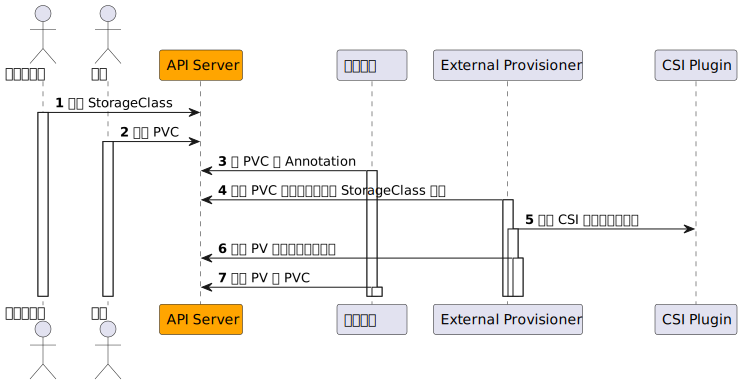
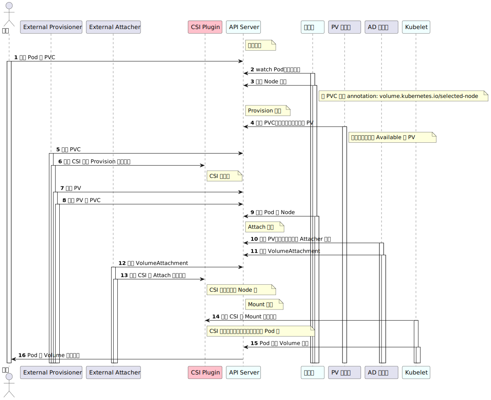

# Kubernetes CSI 插件开发
参考文档：

- [Introduction - Kubernetes CSI Developer Documentation](https://kubernetes-csi.github.io/docs/introduction.html)
- [design-proposals-archive/storage/container-storage-interface.md at main · kubernetes/design-proposals-archive](https://github.com/kubernetes/design-proposals-archive/blob/main/storage/container-storage-interface.md)
- [一文读懂容器存储接口 CSI](https://zhuanlan.zhihu.com/p/364255271)


## 简介
开始前介绍一下，Kubernetes 原生支持一些存储类型，比如 NFS、HostPath、CephFS 等等，这些代码在 Kubernetes 仓库中维护，因此称之为 in-tree。但这带来一些问题：

- 更改 in-tree 存储代码，必须更新 Kubernetes 组件
- in-tree 存储代码引发的 bug 引起 Kubernetes 不稳定
- in-tree 存储代码和 Kubernetes 有同等的特权，存在安全隐患
- 需要 Kubernetes 社区来维护 in-tree 存储代码
- 三方存储开发者必须遵循 Kubernetes 社区的规则开发 in-tree 类型存储代码

以此为由头，Kubernetes 和其他的容器平台厂商联合推出了 CSI（Container Storage Interface）让 Kubernetes 代码和存储代码解耦，第三方存储厂商只需要遵守 CSI 开发存储驱动即可以。
所以有了几个概念：

- CO（Container Orchestrator）：容器编排系统，它不单单指 Kubernetes，也可以是 Mesos 等等
- Node：指运行的工作负载的主机
- Plugin：指公开 gRPC 端点的服务，插件又分为两部分：
   - Node：
   - Controller：以 Deployment 或 StatefulSet 部署在集群内任一节点上即可。它不需要直接访问主机
   - Identity Server：用于标识 CSI 插件

我们选择一个简单的方案，维护同一个 CSI 镜像但是分别在 DaemonSet 和 Deployment 部署。


1. Provision/Delete

Create/Delete 阶段实现与外部存储供应商协调卷的创建/删除处理。
外部存储供应商在 Create 阶段应该创建一个指定大小的存储卷设备，在 Delete 阶段删除这个存储卷设备。

2. Attach/Detach

Attach/Detach 阶段实现将外部存储供应商提供的存储卷设备挂载到本地或者从本地卸载，在必要的情况下还需要进行格式化等操作。

3. Mount/Umount

Mount/Umount 阶段在 CSI 设计文档中没有做详细描述，在前两个阶段完成后，当一个目标 Pod 在某个 Node 节点上调度时，kubelet 会根据前两个阶段返回的结果来创建这个 Pod。
其中挂载分为了 NodeStageVolume 和 NodePublishVolume 两个阶段。
NodeStageVolume 接口主要是针对块存储类型的 CSI 插件而提供的。块设备在 Attach 阶段附着在 Node 上后，需要挂载至 Pod 对应目录上，但因为块设备在 linux 上只能 mount 一次，而在 Kubernetes Volume 的使用场景中，一个 Volume 可能被挂载进同一个 Node 上的多个 Pod 实例中，所以这里提供了 NodeStageVolume 这个接口，使用这个接口把块设备格式化后先挂载至 Node 上的一个临时全局目录，然后再调用 NodePublishVolume 使用 linux 中的 bind mount 技术把这个全局目录挂载进 Pod 中对应的目录上。
NodeUnstageVolume 和 NodeUnpublishVolume 正是 Volume 卸载阶段所分别对应的上述两个流程。




## 流程


### Provisioning Volumes

1. 集群管理员创建 StorageClass，包含 CSI 名称以及必要的参数 Parameter。
```yaml
spec:
  storageClassName: com.mydomain.csi.driver
  resources:
    requests:
      storage: 10Gi
```

2. 用户创建 PVC 资源并指定存储空间大小和 StorageClass。
3. **卷控制器（PersistentVolumeController）**观察到集群中新创建的 PVC 没有与之匹配的 PV，且其使用的存储类型为 out-of-tree，于是为 PVC 打上 annotations： 
```yaml
annotation:
  volume.beta.kubernetes.io/storage-provisioner: com.mydomain.csi.driver
```

4. External Provisioner 观察到 PVC 的 annotation 中 CSI 指定的是自己，于是开始创盘：
   - 获得 StorageClass 和其上的参数，用于 CSI 调用
   - 用过 Unix Socket 调用 CSI 的 CreateVolume，向外部存储供应商创建实际的存储卷设备
5. External Provisioner 创盘成功后会创建 PersistentVolume 资源
6. PersistentVolumeController 会将绑定 PV 和 PVC


### Attaching Volumes

1. AD 控制器（AttachDetachController）观察到使用 CSI 类型 PV 的 Pod 调度到某节点上，会调用**内部 in-tree CSI 插件（csiAttacher）**的 Attach 函数。
2. csiAttacher 会创建一个 VolumeAttachment 对象到集群中。
3. External Attacher 观察到该 VolumeAttachment 对象，并调用**外部 CSI 插件**的** **ControllerPublish 函数以将卷挂接到对应节点上。外部 CSI 插件挂载成功后，External Attacher 会更新相关 VolumeAttachment 对象的 `.Status.Attached` 为 true。
4. AD 控制器 csiAttacher 观察到 VolumeAttachment 对象的 `.Status.Attached` 设置为 true，于是更新AD 控制器内部状态（ActualStateOfWorld），该状态会显示在 Node 资源的 `.Status.VolumesAttached` 上。


### Mounting Volumes

1. **Volume Manager（Kubelet 组件）**观察到有新的使用 CSI 类型 PV 的 Pod 调度到本节点上，于是调用 csiAttacher 的 WaitForAttach 函数。
2. csiAttacher 等待集群中 VolumeAttachment 对象状态 `.Status.Attached` 变为 true。
3. csiAttacher 调用 MountDevice 函数，该函数内部通过 Unix Socket 调用外部 CSI 插件的 NodeStageVolume 函数；之后 csiAttacher 调用**内部 in-tree CSI 插件（csiMountMgr）**的 SetUp 函数，该函数内部会通过 Unix Socket 调用外部 CSI 插件的 NodePublishVolume 函数。


### Unmounting Volumes

1. 用户删除相关 Pod。
2. Volume Manager 观察到包含 CSI 存储卷的 Pod 被删除，于是调用 csiMountMgr 的 TearDown 函数，该函数内部会通过 Unix Socket 调用外部 CSI 插件的 NodeUnpublishVolume 函数。
3. Volume Manager 调用内部 csiAttacher 的 UnmountDevice 函数，该函数内部会通过 Unix Socket 调用外部 CSI 插件的 NodeUnpublishVolume 函数。


### Detaching Volumes

1. AD 控制器观察到包含 CSI 存储卷的 Pod 被删除，此时该控制器会调用 csiAttacher 的 Detach 函数。
2. csiAttacher 会删除集群中相关 VolumeAttachment 对象（但由于存在 finalizer，VolumeAttachment 对象不会立即删除）。
3. External Attacher 观察到集群中 VolumeAttachment 对象的 DeletionTimestamp 非空，于是调用外部 CSI 插件的 ControllerUnpublish 函数以将卷从对应节点上摘除。外部 CSI 插件摘除成功后，External Attacher 会移除相关 VolumeAttachment 对象的 finalizer 字段，此时 VolumeAttachment 对象被彻底删除。
4. AD 控制器中 csiAttacher 观察到 VolumeAttachment 对象已删除，于是更新 AD 控制器中的内部状态；同时AD 控制器更新 Node 资源，此时 Node 资源的 `.Status.VolumesAttached` 上已没有相关挂接信息。


### Deleting Volumes

1. 用户删除相关 PVC。
2. External Provisioner 组件观察到 PVC 删除事件，根据 PVC 的回收策略（Reclaim）执行不同操作：
   - Delete：调用外部 CSI 插件的 DeleteVolume 函数以删除卷设备；一旦卷成功删除，Provisioner 会删除集群中对应 PV 对象。
   - Retain：Provisioner 不执行卷设备删除操作。


## CSI Sidecar 组件介绍


### external-attacher
监视集群中的 VolumeAttachment 资源，然后触发 ControllerPublishVolume 和 ControllerUnpublishVolume。


### external-provisioner
监视集群中的 PersistentVolumeClaim，然后触发 CreateVolume 和 DeleteVolume。


### external-resizer
主要功能是实现持久卷的弹性扩缩容，需要云厂商插件提供相应的能力。
监视集群中的 PersistentVolumeClaim 对象的编辑并触发 ControllerExpandVolume。


### external-snapshotter
主要功能是实现持久卷的快照（VolumeSnapshot）、备份恢复等能力。
监视集群中的 VolumeSnapshotContent，然后触发 CreateSnapshot、DeleteSnapshot 和 ListSnapshots。


### livenessprobe
把 Kubernetes 内置的 Liveness Probe 健康检查，转发为 IdentityServer 的 Probe 方法调用。


### node-driver-registrar
将外部 CSI 插件注册到 Kubelet，Kubelet 绑定 Unix socket 来调用外部 CSI 插件的函数。Kubelet 向其发出 NodeGetInfo、NodeStageVolume 和 NodePublishVolume 调用。


### external-health-monitor-controller


### external-health-monitor-agent


## CSI 接口
存储厂商需实现 CSI 插件的三大接口：`IdentityServer`、`ControllerServer`、`NodeServer`。


### IdentityServer
IdentityServer 主要用于认证 CSI 插件的身份信息，三个方法整体实现都比较简单：


#### GetPluginInfo
只需要返回 CSI 插件名称和版本。


#### GetPluginCapabilities
返回插件的 Controller 的 Capabilities。如果需要插件支持某些功能，则必须返回对应的 Capabilities。


#### Probe
健康检查，永远返回 OK 即可。


### ControllerServer
ControllerServer 主要负责存储卷及快照的 Create/Delete 以及 Attach/Detach 操作


#### CreateVolume
创建实际的存储卷设备。


#### DeleteVolume
删除实际的存储卷设备。


#### ControllerPublishVolume


#### ControllerUnpublishVolume


#### ValidateVolumeCapabilities


#### ListVolumes


#### GetCapacity


#### ControllerGetCapabilities


#### CreateSnapshot
创建卷快照。


#### DeleteSnapshot
删除卷快照。


#### ListSnapshots
查询卷快照。


#### ControllerExpandVolume


#### ControllerGetVolume


#### ControllerModifyVolume


### NodeServer
NodeServer 主要负责存储卷 Mount/Umount 操作


#### NodeStageVolume


#### NodeUnstageVolume


#### NodePublishVolume


#### NodeUnpublishVolume


#### NodeGetVolumeStats
为 CSI 实现监控，Kubelet 会调用该方法并反映在 metrics 上。

- kubelet_volume_stats_capacity_bytes：存储卷容量
- kubelet_volume_stats_used_bytes：存储卷已使用容量
- kubelet_volume_stats_available_bytes：存储卷可使用容量
- kubelet_volume_stats_inodes：存储卷 inode 总量
- kubelet_volume_stats_inodes_used：存储卷 inode 使用量
- kubelet_volume_stats_inodes_free：存储卷 inode 剩余量


#### NodeExpandVolume


#### NodeGetCapabilities


#### NodeGetInfo
