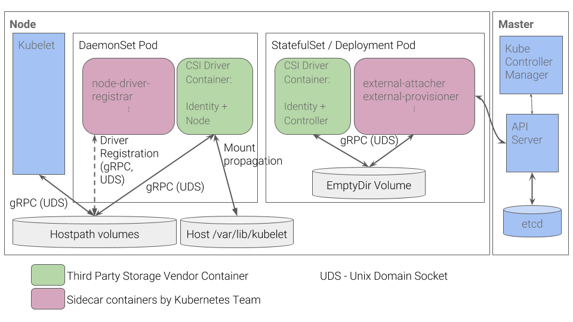

# Kubernetes CSI 插件开发
参考文档：

- [Introduction - Kubernetes CSI Developer Documentation](https://kubernetes-csi.github.io/docs/introduction.html)
- [design-proposals-archive/storage/container-storage-interface.md at main · kubernetes/design-proposals-archive](https://github.com/kubernetes/design-proposals-archive/blob/main/storage/container-storage-interface.md)
- [一文读懂容器存储接口 CSI](https://zhuanlan.zhihu.com/p/364255271)

开始前介绍几个概念：

- CO（Container Orchestrator）：容器编排系统，它不单单指 Kubernetes，也可以是 Mesos 等等
- Node：指运行的工作负载的主机
- Plugin：指公开 gRPC 端点的服务，插件又分为两部分：
   - Node：
   - Controller：以 Deployment 或 StatefulSet 部署在集群内任一节点上即可。它不需要直接访问主机
   - Identity Server：用于标识 CSI 插件

我们选择一个简单的方案，维护同一个 CSI 镜像但是分别在 DaemonSet 和 Deployment 部署。 

## CSI Sidecar 组件介绍

### external-attacher
External-Attacher 内部会时刻 watch 集群中的 VolumeAttachment 资源和 PersistentVolume，然后触发 ControllerPublishVolume 和 ControllerUnpublishVolume 的 gRPC 调用。

### external-provisioner

### external-resizer

### external-snapshotter

### livenessprobe
`livenessprobe` sidecar 会把 Kubernetes 内置的 Liveness Probe 健康检查，转发为 IdentityServer 的 Probe 方法 gRPC 调用。

### node-driver-registrar
将外部 CSI 插件注册到 Kubelet，Kubelet 绑定 Unix socket 来调用外部 CSI 插件的函数。

### external-health-monitor-controller

### external-health-monitor-agent

## CSI 接口
存储厂商需实现 CSI 插件的三大接口：`IdentityServer`、`ControllerServer`、`NodeServer`。

### IdentityServer
IdentityServer 主要用于认证 CSI 插件的身份信息，三个方法整体实现都比较简单：

#### GetPluginInfo
只需要返回 CSI 插件名称和版本。

#### GetPluginCapabilities
返回插件的 Controller 的 Capabilities。如果需要插件支持某些功能，则必须返回对应的 Capabilities。

#### Probe
健康检查，永远返回 OK 即可。

### ControllerServer
ControllerServer 主要负责存储卷及快照的创建/删除以及挂接/摘除操作

### NodeServer
NodeServer 主要负责存储卷挂载/卸载操作

