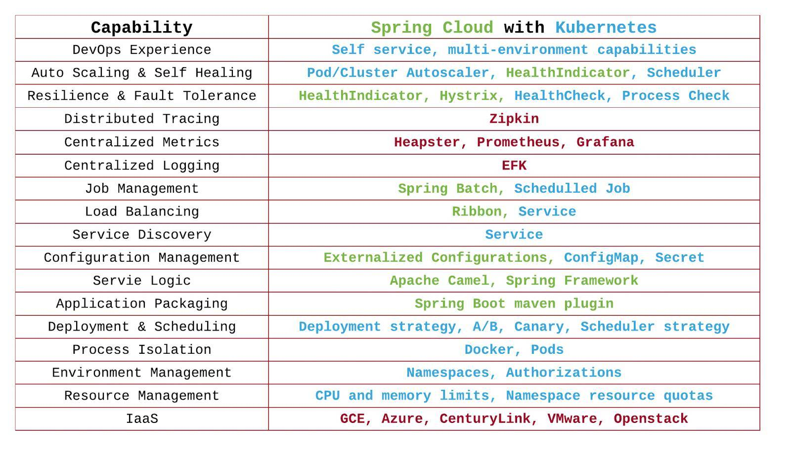
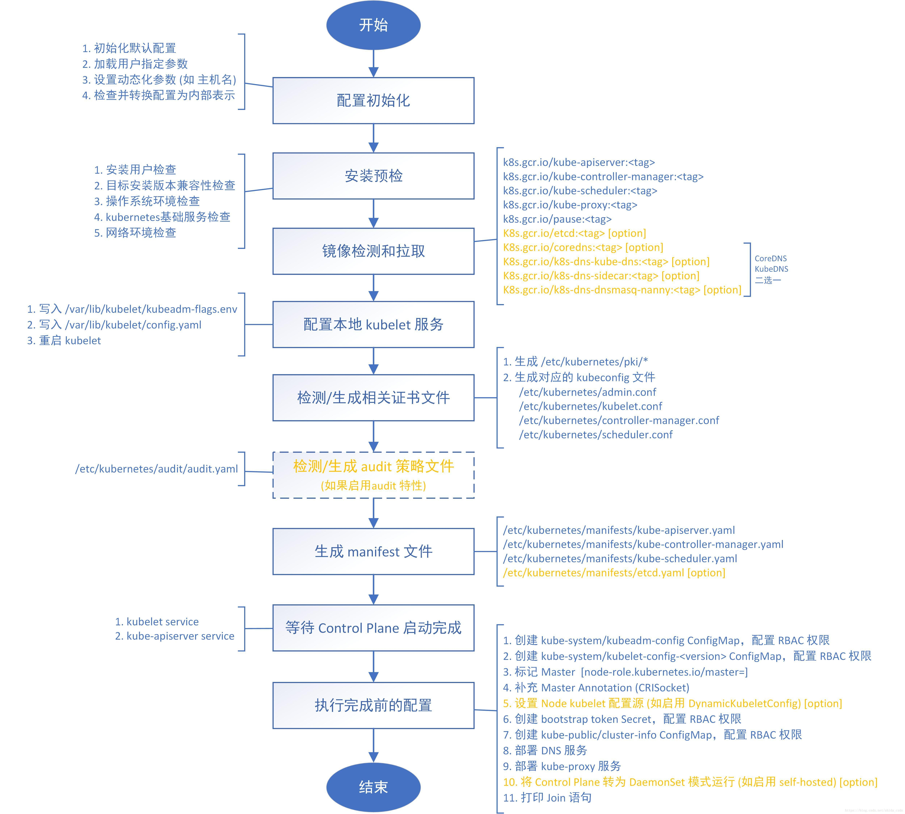

# Kubernetes 介绍
参考文档：

- [https://kubernetes.io/docs/reference/generated/kubernetes-api/v1.23/#service-v1-core](https://kubernetes.io/docs/reference/generated/kubernetes-api/v1.23/#service-v1-core)

Kubernetes 是 Google 推出的容器编排技术，由 Golang 开发。Google 背书，通过自家大量的容器管理和运维，目前在容器编排技术上只此一家。 Kubernetes 官方文档的一张配图解释了传统部署、虚拟机部署、容器化部署三者的区别： 

# Kubernetes 架构
Kubernetes 分为 master 和 worker 两类节点：

- master 负责调度，需要多台做纯粹的冗余保持 HA
- worker 负责实际负载

master 由三部分组成：

- API Server：它是一个接口服务，接受所有外界操作 Kubernetes 的指令
- Scheduler：调度器，它负责选择合适的节点来运行容器
- Controller：控制器，通过 ControlLoop 时刻维持容器与声明的状态一致
- Etcd：基于 Raft 算法的分布式键值数据库

### Kubernetes 和 Spring Cloud 的对比
有很多人问同样是微服务，用 Kubernetes 做容器编排和 Spring Cloud 做云服务框架有什么区别：

- 管理方式：
   - 来自不同的业务侧，运维和开发格管一摊
   - Kubernetes 是完全来自运维侧的技术推进
   - Spring Cloud 是开发侧的技术推进。即使上了 Kubernetes，仍然可以使用 Spring Cloud 作为业务应用层的微服务框架。
- 技术栈：
   - Spring Cloud 限制了只能使用 Java 作为唯一的技术栈。在一个大公司的平台内，往往不只一种开发语言，高性能计算会采用 C/C++，应用层会使用 Java/Golang，运维会使用 Python/Golang 等等。这种情况下 Spring Cloud 就将会显得掣肘。
   - Kubernetes 不限制任何技术栈，只要是容器都能统一管理。
- 能力：
   - 下图是 Kubernetes 和 Spring Cloud 在不同部分上的组件。可以看到自动扩展和自动治愈等等方面上都有各自的组件；但在一些例如资源隔离，只有 Kubernetes 满足需求；而在日志采集、链路追踪上，则有新的元原生组件来弥补。

# 
