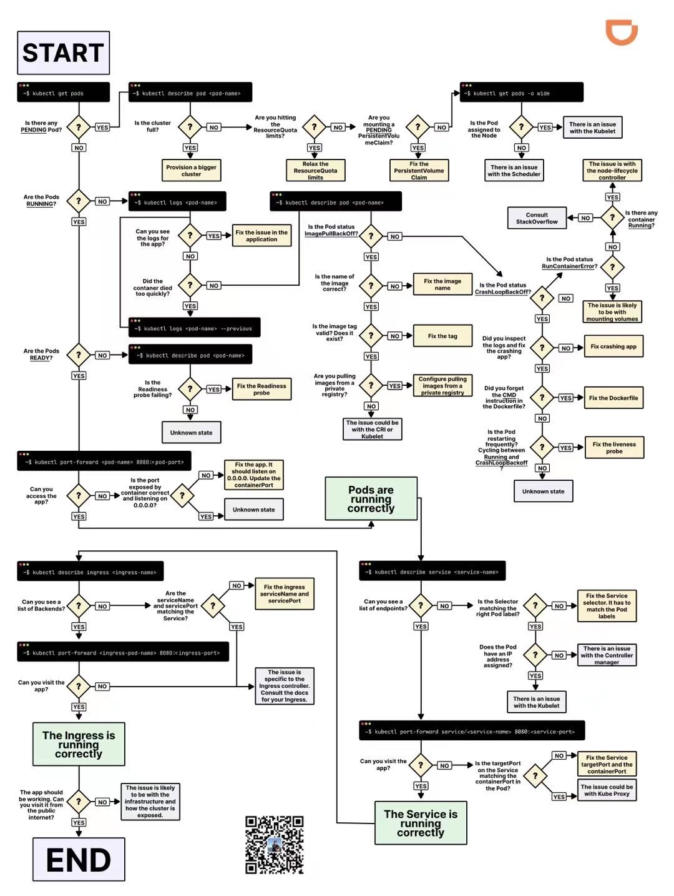

# Kubectl 命令行工具


## Kubectl 通用命令
Kubectl 很多命令和 docker 是通用的, 无非是增加 `-n <namespace>` 这个参数:
```bash
# 进入 pod
kubectl exec -it <pod> -n <namespace> -- bash

# 查看 pod 日志
kubectl log -f <pod> -n <namespace>
```
其他命令也很通俗易懂, 总体而言以下几种命令使用频率比较高:
```bash
# 查看 kubernetes 资源的配置:
kubectl get <resource> <name> -n <namespace> -o yaml

# 修改 kubernetes 资源的配置
kubectl edit <resource> <name> -n <namespace>

# 删除被驱逐的 pod
kubectl delete pod $(kubectl get pod -A | grep Evicted | awk '{printf "%s -n %s\n",$2,$1}')
```
一个更加复杂的例子, 比如查看 Ingress-nginx 的 `nginx.conf`:
```bash
kubectl exec -it $(kubectl get pods -n gateway  | grep -E ^gateway | awk '{print $1}') \
  -n ingress-nginx -- bash -c "cat /etc/nginx/nginx.conf" | less 
```
导出 Kubernetes 所有的 Secret，用于环境迁移：
```bash
cat <<EOF > ./go-template-file.tpl
{{- range $item := .items }}
{{- if eq $item.type "Opaque" }}

# sercret: {{ $item.metadata.name }}
# namespace: {{ $item.metadata.namespace }}
{{- range $k, $v := $item.data }}
{{ $k }}={{ $v | base64decode }}
{{- end }}
{{- end }}
{{- end }}
EOF

kubectl get secret -A  -o go-template-file='./go-template-file.tpl' > secrets.txt
```





## 
