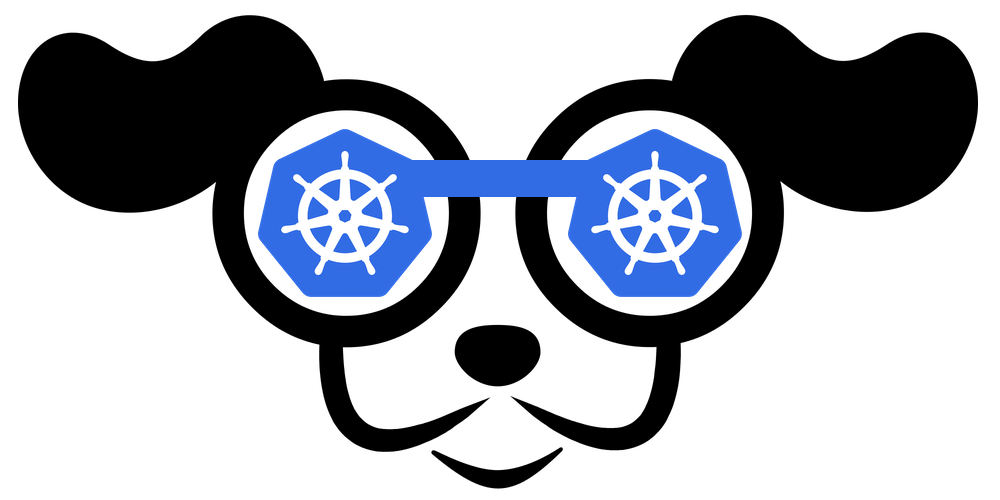

# Kubernetes UI
## K9S

  
参考文档：  
+ [此处为语雀卡片，点击链接查看](about:blank#Isn2d)

:::info
**K9S - Kubernetes CLI To Manage Your Clusters In Style!**  
:::
非常还用的 Kubernetes 命令行管理工具，涵盖了所有 Kubernetes 的管理功能。  
如果用习惯了之后就会像 vim 一样顺手，比 Web UI 更加快速和易于操作。  
[此处为语雀卡片，点击链接查看](about:blank#vKb5T)

K9S 也非常适合二次开发，你可以为你常用的功能编写插件，或者 fork 仓库二次开发。例如，我为 K9S 增加了管理 Harbor 实例和项目的功能，可以查找 Harbor 上的镜像和 Chart。  

  
# Rancher
参考文档：  
+ [此处为语雀卡片，点击链接查看](about:blank#P6syC)

Rancher 自带了一套 k3s 单机。实际使用下来，性能要求略高于裸机 k3s。如果是开发或者个人建站使用，更推荐使用 k3s。  
我司生产上在两台超融合上的虚拟机使用 RKE 安装 Rancher，作为管理界面管理多套 k8s 集群。因此这是一个生产级的应用，包括内置了 Rancher Pipeline（用起来真是世界上安装最简单的 CI）。  
### 安装步骤 using Docker
安装 rancher 镜像，然后打开网页初始化 Rancher  
+ v2.3.1  // 公司生产版本
+ v2.5.11 // 当前比较新的稳定版本
+ v2.6.2 // 2.6 版本的全新
[此处为语雀卡片，点击链接查看](about:blank#89Yxf)

v2.6 以下首次登录需要密码，根据提示设置新的管理员密码。  
v2.6 以上需要用如下命令查看：  
[此处为语雀卡片，点击链接查看](about:blank#xvCzA)

直接访问 `https://xxx.xxx.xxx.xxx:8443` 即可。  
### 安装步骤 using Helm
以下是在公司中使用 helm 安装的步骤：  
[此处为语雀卡片，点击链接查看](about:blank#TFUQj)

### Rancher 导入集群
打开 Rancher 界面，点击 `import generic` 并设定好集群名，Rancher 临时生成一段 YAML。这段 YAML 在待托管的 Kubernetes master 节点上执行即可，它会为新集群安装 Rancher 的探针和 Agent。  
导入集群：  
[此处为语雀卡片，点击链接查看](about:blank#i3yLW)

如果 Rancher 没有安全的HTTPS证书：  
[此处为语雀卡片，点击链接查看](about:blank#GJ45v)

如果有错误，那么使用这个命令：  
[此处为语雀卡片，点击链接查看](about:blank#d6nBK)

### 常见运维问题
#### Webhook 证书过期
参考文档：  
+ [此处为语雀卡片，点击链接查看](about:blank#eoIBi)

+ [此处为语雀卡片，点击链接查看](about:blank#WJDMC)

Rancher 内部的 API 证书默认有效期一年，用了一年后会发生 webhook 过期的导致一部分功能无法使用，比如创建用户。那么可以删除该 secret，再重启 pod 来实现功能。  
[此处为语雀卡片，点击链接查看](about:blank#wFrff)

#### Serving-cert 证书过期
参考文档：  
+ [此处为语雀卡片，点击链接查看](about:blank#Ey8OB)

如果使用 Rancher 2.5+ 的话，`serving-cert` 证书过期是不要紧的。  
> This is legacy and is no longer needed/used assuming you are running rancher 2.5+ so it's fine if it expires  

## Kubernetes-Dashboard
参考文档：  
+ [此处为语雀卡片，点击链接查看](about:blank#mShsk)

+ [此处为语雀卡片，点击链接查看](about:blank#zmdxB)

[此处为语雀卡片，点击链接查看](about:blank#RZUSA)

## Kuboard
参考文档：  
+ [安装 Kuboard v2 - Kuboard 中文站](https://kuboard.cn/install/install-dashboard.html)
这是一个国产免费的 Kubernetes 控制面板。目前已经更新到 v3 版本，v2 处于长期支持版本。这里使用 v2 版本即可。  
非常强大的 Kubernetes UI，但是个人界面上的元素过于多，面板花哨。  
### 安装步骤
[此处为语雀卡片，点击链接查看](about:blank#nXuLX)

查看 Kuboard 运行状态：  
[此处为语雀卡片，点击链接查看](about:blank#KEvWO)

输出结果如下所示：  
[此处为语雀卡片，点击链接查看](about:blank#H9MEA)

### 获取Token
您可以获得管理员用户，只读用户的Token。我这里只使用管理员用户：  
+ 此 Token 拥有 ClusterAdmin 的权限, 可以执行所有操作
[此处为语雀卡片，点击链接查看](about:blank#iHJgX)

取输出信息中 token 字段，下步要使用。Kuboard Service 使用了 NodePort 的方式暴露服务，NodePort 为 32567，您可以按如下方式访问 Kuboard：`http://xxx.xxx.xxx.xxx:32567/`  
输入前一步骤中获得的 token，可进入 **Kuboard 集群概览页**。  
