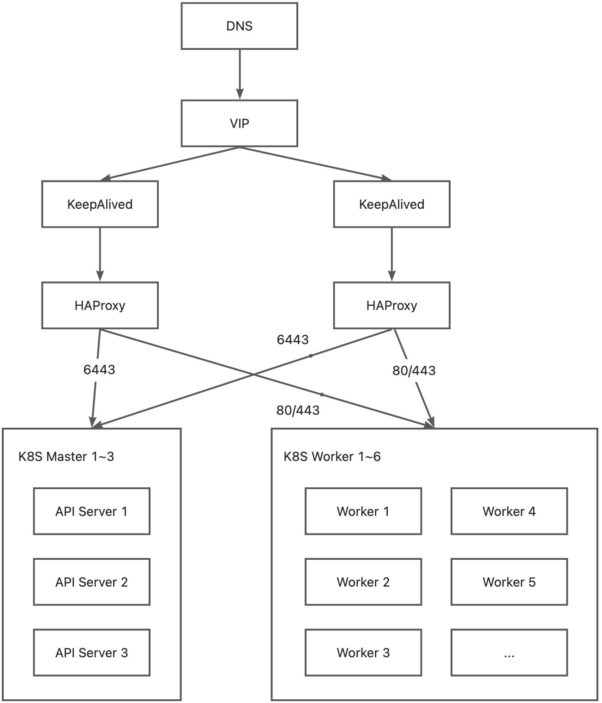

# HAProxy + KeepAlived


## 介绍
HAProxy 与 Nginx 都可以用做负载均衡和 Web 服务器。

- 前者更加专注于四层协议转发（e.g. TCP），也可以转发七层协议（e.g. HTTP）。
- 后者更加专注于 Web 服务器，默认不启用四层协议，但具有更高的可配置性。

KeepAlived 工作在 L3-5 协议，使用了 Linux 内核中的 LVS 和 VRRP 技术：

- VRRP（Virtual Router Redundancy Protocol 虚拟路由器冗余协议）出现的目的就是为了解决静态路由单点故障问题的，它能够保证当个别节点宕机时，整个网络可以不间断地运行。
- 内部通过选举协议来选择主备，来动态的将路由任务交给 LAN 中虚拟路由器中的某台VRRP路由器。


## 例子
以代理 Kubernetes 集群的 Master 和 Worker 为例子：
两个 KeepAlived 代理一个 VIP 地址，HAProxy 通过四层代理将 6443 端口和 80/443 端口的流量分别转发到 K8S Master 的 API Server 和 K8S Worker 的服务端口上



## 包管理器安装


### 环境准备
HAProxy 的环境准备：

- 至少需要两台服务器
- 一个额外可分配的空闲 IP


### 安装 HAProxy
用包管理器下载安装 HAProxy：
```bash
sudo apt update
sudo apt install -y haproxy
```
修改 HAProxy 的配置文件：
```bash
sudo vim /etc/haproxy/haproxy.cfg
```
```
# 追加到 haproxy.cfg 默认配置之后
# 其中
#   <k8s-master-IP地址>  例如：196.168.0.1
#   <k8s-worker-IP地址>  例如：196.168.0.1, 196.168.0.2
# 等等

frontend 
    bind 0.0.0.0:6443
    mode tcp
    option tcplog
    timeout client 30000
    default_backend example-k8s-master
backend example-k8s-master
    mode tcp
    option tcplog
    option tcp-check
    timeout server 30000
    balance roundrobin
    default-server inter 10s downinter 5s rise 2 fall 2 slowstart 60s maxconn 250 maxqueue 256 weight 100
        server apiserver1 <k8s-master-IP地址>:6443 check
          ...

frontend example-k8s-worker-http
    bind 0.0.0.0:80
    mode tcp
    option tcplog
    timeout client 30000
    default_backend example-k8s-worker-http
backend example-k8s-worker-http
    mode tcp
    option tcplog
    option tcp-check
    timeout server 30000
    balance roundrobin
    default-server inter 10s downinter 5s rise 2 fall 2 slowstart 60s maxconn 250 maxqueue 256 weight 100
        server worker1 <k8s-worker-IP地址>:80 check
          ...

frontend example-k8s-worker-https
    bind 0.0.0.0:443
    mode tcp
    option tcplog
    timeout client 30000
    default_backend example-k8s-worker-https
backend example-k8s-worker-https
    mode tcp
    option tcplog
    option tcp-check
    timeout server 30000
    balance roundrobin
    default-server inter 10s downinter 5s rise 2 fall 2 slowstart 60s maxconn 250 maxqueue 256 weight 100
        server worker1 <k8s-worker-IP地址>:443 check
```
配置说明如下：

| 配置 |  |
| --- | --- |
| global | 全局配置参数段，主要用来控制 HAProxy 启动前的进程及系统相关设置 |
| defaults | 配置一些默认参数，如果 frontend、backend、listen 等段未设置则使用 defaults 段设置 |
| listen | 监听配置 |
| frontend | 用来匹配接收客户所请求的域名、URI 等，并针对不同的匹配，做不同的请求处理 |
| backend | 定义后端服务器集群，以及对后端服务器的一些权重、队列、连接数等选项的设置 |

```bash
# 检查配置文件语法
sudo haproxy -c -f /etc/haproxy/haproxy.cfg

# 启动调试功能, 将显示所有连接和处理信息在屏幕
sudo haproxy -d -f /etc/haproxy/haproxy.cfg

# 显示haproxy编译和启动信息
sudo haproxy -vv
```
设置开机启动并启动服务：
```bash
sudo systemctl enable haproxy
sudo systemctl start  haproxy
sudo systemctl status haproxy
```


### 安装 KeepAlived
用包管理器下载安装 KeepAlived：
```bash
sudo apt update
sudo apt install -y keepalived
```
修改 KeepAlived 的配置文件，根据实际的网卡名修改 `interface` 的名称：
```bash
sudo vim /etc/keepalived/keepalived.conf
```
```
! Configuration File for keepalived
vrrp_instance VI_1 {
    state BACKUP
    interface ens6
    virtual_router_id 61
    priority 90
    advert_int 1
    authentication {
        auth_type PASS
        auth_pass 1111
    }
    virtual_ipaddress {
        漂移IP地址/24
    }
}
```
```bash
# 显示 KeepAlived 版本
keepalived -v
```
设置开机启动并启动服务。
```bash
sudo systemctl enable keepalived
sudo systemctl start  keepalived
sudo systemctl status keepalived
```


## 高可用测试
HAProxy 和 KeepAlived 都启动后，`ip a`查看 IP 地址，某节点会占用漂移地址，且`ping`IP 地址可以`ping`通。
```bash
ip a | grep inet

ping <漂移地址>
```
其中一台 HAProxy 关机或禁用网卡模拟断电，另一台机器将占用虚拟 IP 实现高可用。将断电机器重新启动后，关闭另一台机器，其他 HAProxy 节点将占用虚拟 IP（两节点的话虚拟 IP 漂移到原主机上）。
```bash
# HAProxy节点1
reboot

# HAProxy节点2
ip a | grep inet
ping <漂移地址>

# HAProxy节点2
reboot

# HAProxy节点1
ip a | grep inet
ping <漂移地址>
```


## 注意点
之前发生了一个悲惨的故事，发现一台 KeepAlived 服务器上的 DNS 配置有问题，于是重启了网卡。
此时发现 KeepAlived 默默的挂了，重启 KeepAlived 服务即可：
```bash
# 发现DNS配置有问题
cat /etc/resolv.conf

# 重启网卡
sudo service network restart

# 重启KeepAlived
sudo systemctl restart keepalived
```


## Docker 安装
用于单机模拟和调试 HAProxy。
由于 HAProxy 官方不提供任何默认配置（官方理由是其认为不存在任何通用的转发配置），所以必须自己编写配置文件 `haproxy.cfg`，否则无法启动。
编写配置文件后，可以通过如下命令启动并检查：
```bash
docker run -it --rm \
  --name haproxy-syntax-check \
  haproxy \
  haproxy -c -f /usr/local/etc/haproxy/haproxy.cfg
```
```bash
docker run \
  --detach=true \
  --sysctl net.ipv4.ip_unprivileged_port_start=0 \
  --volume=/etc/haproxy:/usr/local/etc/haproxy:ro \
  haproxy
```
