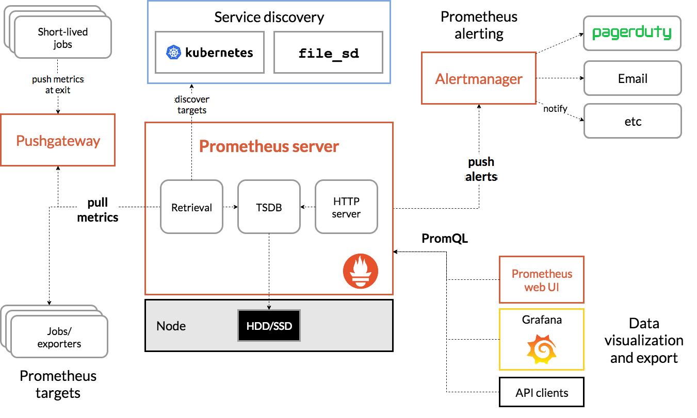

# Prometheus 入门
Prometheus Server 负责去每个 Exporter 上拉去数据到内存里，默认是`/metrics`。

AlertManager 根据数据计算规则，发送报警通知。

TSDB：可以用 InfluxDB，或者更加新的 VictoriaMetrics。

Grafana 作为前端页面发送 PromQL 查询语句给 TSDB，渲染视图。


Prometheus 推荐的采集方式是由 Prometheus 主动向各个注册节点 exporter 的 endpoint 来拉取数据，默认是`/metrics`。这样的好处是：

+ Prometheus 如果处理不过来，并不会在收到大量堆积的上报监控数据
+ Prometheus 服务发现来发现 exporter，而不需要在每个 exporter 上配置推送的服务端地址
+ Prometheus 主动选择获取指标的周期等配置，也不需要在每个 exporter 上配置推送的周期等配置

当然它也支持用户自己写代码向 Prometheus 的 Push Gateway 主动推送数据。





```yaml
server:
  ingress:
    enabled: true
    host:
      - prometheus.mydomain.com
```

`registry.k8s.io/kube-state-metrics/kube-state-metrics` 的镜像可能拉不下来，可以改用 `bitnami/kube-state-metrics`。

# Prometheus 告警二次开发
参考文档：

+ [AlertManager Webhook Configuration - Prometheus 官网](https://prometheus.io/docs/alerting/latest/configuration/#webhook_config)

## AlertManager Webhook
AlertManager 推送的告警 JSON 格式。AlertManager 会将报警信息推送到指定的 Webhook。

```json
{
  "version": "4",
  "groupKey": <string>,              // key identifying the group of alerts (e.g. to deduplicate)
  "truncatedAlerts": <int>,          // how many alerts have been truncated due to "max_alerts"
  "status": "<resolved|firing>",
  "receiver": <string>,
  "groupLabels": <object>,
  "commonLabels": <object>,
  "commonAnnotations": <object>,
  "externalURL": <string>,           // backlink to the Alertmanager.
  "alerts": [
    {
      "status": "<resolved|firing>",
      "labels": <object>,
      "annotations": <object>,
      "startsAt": "<rfc3339>",
      "endsAt": "<rfc3339>",
      "generatorURL": <string>,      // identifies the entity that caused the alert
      "fingerprint": <string>        // fingerprint to identify the alert
    },
    ...
  ]
}
```

# Prometheus 采集器安装
## Node Exporter 安装
Node Exporter 是 Prometheus 体系中最基本的一个 exporter 用于获得节点上服务器信息。

```bash
[Unit]
Description=Node Exporter

[Socket]
ListenStream=9100

[Install]
WantedBy=sockets.target
```

```bash
[Unit]
Description=Node Exporter
Requires=node_exporter.socket

[Service]
User=node_exporter
ExecStart=/usr/local/bin/node_exporter --web.systemd-socket

[Install]
WantedBy=multi-user.target
```

