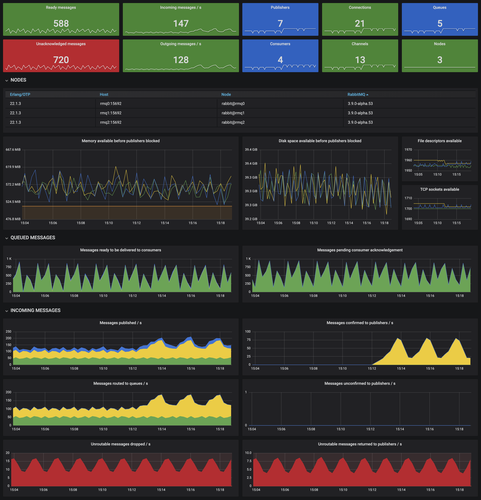

<a name="Fl6A5"></a>
# RabbitMQ Prometheus 监控
参考文档：

- [RabbitMQ Prometheus 插件 - RabbitMQ 官网](https://www.rabbitmq.com/prometheus.html)
- [RabbitMQ Dashboard - Grafana 官网](https://grafana.com/grafana/dashboards/10991-rabbitmq-overview/)
<a name="dL2Pm"></a>
## 监控插件安装
RabbitMQ 已经内置了 Prometheus 插件，所以直接通过命令行开启，无需其他的 Exporter。<br />在 RabbitMQ 集群上所有服务器执行以下指令，开启 RabbitMQ 自带的 Prometheus 监控插件：
```bash
rabbitmq-plugins enable rabbitmq_prometheus
```
安装后，用 `curl` 命令请求监控端口：
```bash
curl -s localhost:15692/metrics            | head -n 3
curl -s localhost:15692/metrics/per-object | head -n 3
```
结果如下：
```bash
# TYPE erlang_mnesia_held_locks gauge
# HELP erlang_mnesia_held_locks Number of held locks.
erlang_mnesia_held_locks 0

# TYPE erlang_vm_dirty_cpu_schedulers gauge
# HELP erlang_vm_dirty_cpu_schedulers The number of scheduler dirty CPU scheduler threads used by the emulator.
erlang_vm_dirty_cpu_schedulers 2
```
然后在 Prometheus 所在的 Kubernetes 上生成 secret 和 Prometheus CRD
```yaml
- job_name: "external/rabbitmq-pre-object"
  metrics_path: "/metrics/per-object"
  static_configs:
    - targets:
        - "<rabbit01_ip>:15692"
        - "<rabbit02_ip>:15692"
        - "<rabbit03_ip>:15692"
```
```bash
kubectl create secret generic additional-scrape-configs \
  --from-file=external_rabbit.yaml \
  --dry-run=client -o yaml > additional-scrape-configs.yaml

kubectl apply -f additional-scrape-configs.yaml -n monitoring
```
<a name="KObYG"></a>
## Grafana 仪表盘
在 Grafana 上导入 [RabbitMQ-Overview 仪表盘](https://grafana.com/grafana/dashboards/10991)，这是 RabbitMQ 官方提供的仪表盘。
```
10991
```

