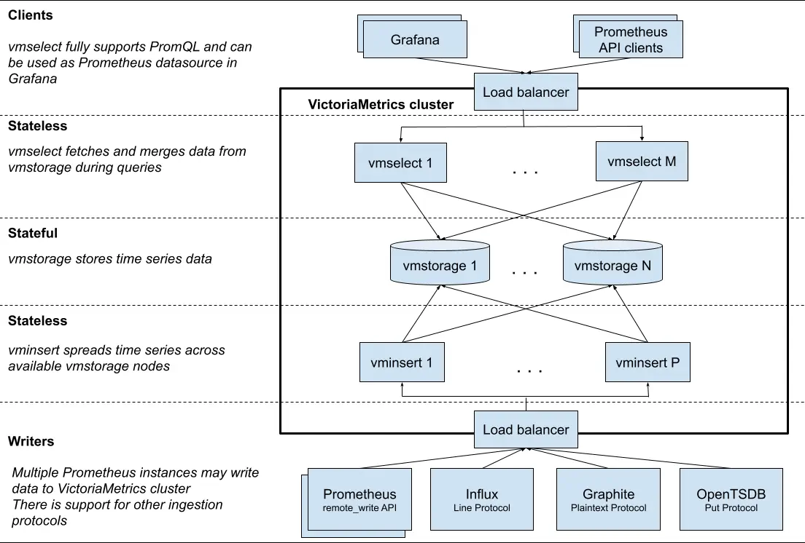

# Victoria Metrics
本文 VM 指的是 Victoria Metrics。

## 简介
VM 采用分布式架构，对比 Prometheus 的所有职责 All In One，VM 把写入、读取、存储分为了三层各司其职。而如果需要使用 Prometheus AlertManager 的功能， 那么需要通过引入 VMAlert 来管理报警的 VMRule，然后推送给 Prometheus AlertManager。




### 差异对比
VM 与 Prometheus/Thanos 对比具有更低的 CPU 占用、内存占用、磁盘空间。

实际实践经验中 Prometheus/Thanos 在单个大集群下无法完成很多查询，Grafana 端可能会直接超时。但 VM 在作为多集群的联邦集群下，仍然可以较快的完成查询。

### 如何集成或迁移
很多公司的业务线已经运行着 Prometheus/Thanos 集群，那么需要思考的是如何去集成原有的 Prometheus/Thanos 体系到 VM 呢？

+ 一个折衷的方案：可以采用各个 Prometheus 用 remote write 推送到统一的 VM，类似于 Federal Prometheus。这样 VM 既可以作为 Prometheus 的远端、长期存储，又可以维持原有的 Prometheus 不需要额外的改动。如果没有 Prometheus 很大的性能瓶颈，确实没有必要完全切换到 VM
+ 或者可以使用 VM 推出的 CLI 工具 vmctl 将 Prometheus 集群的数据完全迁移到 VM

## Victoria Metrics Operator
比较推荐的使用 Victoria Metrics Operator 来托管集群和组件的创建：

通过 Helm 安装 Victoria Metrics Operator

```bash
helm repo add vm https://victoriametrics.github.io/helm-charts/
helm repo update

helm show values vm/victoria-metrics-operator > values.yaml

vim values.yaml

helm install victoria-metrics-operator vm/victoria-metrics-operator -f values.yaml -n monitoring
```

推荐的 values.yaml

```yaml
image:
  repository: harbor.domain.com/victoriametrics/operator
  tag: 0.37.0
  pullPolicy: IfNotPresent
createCRD: true

operator:
  disable_prometheus_converter: false
  useCustomConfigReloader: true

# 建议所有的资源都放在单独的命名空间下
watchNamespace: "monitoring"

env:
  - name: VM_CUSTOMCONFIGRELOADERIMAGE
    value: harbor.domain.com/victoriametrics/operator:config-reloader-v0.32.0
  - name: VM_VMALERTMANAGER_CONFIGLOADERIMAGE
    value: harbor.domain.com/prometheus/config-reload:v0.3.0
  - name: VM_VMALERTDEFAULT_CONFIGLOADERIMAGE
    value: harbor.domain.com/prometheus/config-reload:v0.3.0
```

创建集群：

```yaml
# vmcluster.yaml
apiVersion: operator.victoriametrics.com/v1beta1
kind: VMCluster
metadata:
  name: monitoring-vmcluster
  namespace: monitoring
spec:
  retentionPeriod: "1"
  replicationFactor: 2
  vmstorage:
    replicaCount: 4
    image:
      repository: harbor.domain.com/victoriametrics/vmstorage
      tag: v1.100.1-cluster
      pullPolicy: IfNotPresent
    extraArgs:
      "envflag.enable": "true"
      "envflag.prefix": "VM_"
    logFormat: json
    storageDataPath: "/vm-data"
    storage:
      volumeClaimTemplate:
        spec:
          resources:
            requests:
              storage: "256Gi"
          accessMode: [ "ReadWriteOnce" ]
          storageClassName: "<Your Storage Class>"
    resources:
      limits:
        cpu: "4"
        memory: "32Gi"
      requests:
        cpu: "2
        memory: "8Gi"
  vmselect:
    replicaCount: 2
    image:
      repository: harbor.domain.com/victoriametrics/vmselect
      tag: v1.100.1-cluster
      pullPolicy: IfNotPresent
    extraArgs:
      "envflag.enable": "true"
      "envflag.prefix": "VM_"
      "vmalert.proxyUrl": <vmalert service>
    logFormat: json
    resources:
      limits:
        cpu: "2"
        memory: "2Gi"
      requests:
        cpu: "500m"
        memory: "512Mi"
  vminsert:
    replicaCount: 4
    image:
      repository: harbor.domain.com/victoriametrics/vminsert
      tag: v1.100.1-cluster
      pullPolicy: IfNotPresent
    extraArgs:
      "envflag.enable": "true"
      "envflag.prefix": "VM_"
      "maxLabelsPerTimeseries": "150"
      "maxConcurrentInserts": "32"
    logFormat: json
    resources:
      limits:
        cpu: "6"
        memory: "4Gi"
      requests:
        cpu: "2"
        memory: "1Gi"
```

VM 推送告警仍然要通过 Prometheus 的 Alertmanager，安装 VMAlertmanager。VMAlertmanager CRD 有三种方式配置 Alertmanager：

+ 使用 Secret 注入
+ 使用内联的 YAML
+ 使用 VMAlertmanagerConfig CRD

比较推荐使用 VMAlertmanagerConfig CRD：

```yaml
---
apiVersion: operator.victoriametrics.com/v1beta1
kind: VMAlertmanager
metadata:
  name: monitoring-alertmanager
  namespace: monitoring
spec:
  replicaCount: 2
  image:
    repository: harbor.domain.com/prom/alertmanager
    tag: v0.26.0
    pullPolicy: IfNotPresent
  # 这是一个令人困惑的配置, 默认关闭
  # 关闭时会为 route 自动插入一条 namespace = "xxx" 条件
  # 从而导致路由失效, 所有告警都会进入默认路由
  disableNamespaceMatcher: true
  configNamespaceSelector:
    matchLabels:
      "kubernetes.io/metadata.name": monitoring
  configSelector:
    matchLabels:
      "app.kubernetes.io/component": alertmanager-config
      "app.kubernetes.io/instance": alertmanager-config
      "app.kubernetes.io/part-of": monitoring-vmcluster
  resources:
    requests:
      memory: "64Mi"
      cpu: "200m"
    limits:
      memory: "256Mi"
      cpu: "500m"
---
apiVersion: operator.victoriametrics.com/v1beta1
kind: VMAlertmanagerConfig
metadata:
  name: monitoring-alertmanager-config
  namespace: monitoring
  labels:
    "app.kubernetes.io/component": alertmanager-config
    "app.kubernetes.io/instance": alertmanager-config
    "app.kubernetes.io/part-of": monitoring-vmcluster
spec:
  # Prometheus Alertmanager Config
  ...
```

VMAlert CRD 也有三种方式配置，推荐使用 VMRule CRD 来托管告警规则：

```yaml
---
apiVersion: operator.victoriametrics.com/v1beta1
kind: VMAlert
metadata:
  name: monitoring-vmalert
  namespace: monitoring
spec:
  replicaCount: 2
  evaluationInterval: "15s"
  image:
    repository: harbor.domain.com/victoriametrics/vmalert
    tag: v1.93.4
    pullPolicy: IfNotPresent
  ruleNamespaceSelector:
    matchLabels:
      "kubernetes.io/metadata.name": monitoring
  ruleSpaceSelector:
    matchLabels:
      "app.kubernetes.io/component": alertmanager-rule
      "app.kubernetes.io/instance": alertmanager-rule
      "app.kubernetes.io/part-of": monitoring-vmcluster
  datasource:
    url: http://vmselect....:8481/select/0/prometheus
  notifiers:
    - url: http://vmalertmanager-0.vmalertmanager...:9093
    - url: http://vmalertmanager-1.vmalertmanager...:9093
  remoteWrite:
    url: http://vminsert...:8480/insert/0/prometheus
  remoteRead:
    url: http://vmselect....:8481/select/0/prometheus
---
apiVersion: operator.victoriametrics.com/v1beta1
kind: VMRule
metadata:
  name: monitoring-vmalert-rule
  namespace: monitoring
  labels:
    "app.kubernetes.io/component": alertmanager-rule
    "app.kubernetes.io/instance": alertmanager-rule
    "app.kubernetes.io/part-of": monitoring-vmcluster
spec:
  # Prometheus Rule Config
  ...
```

