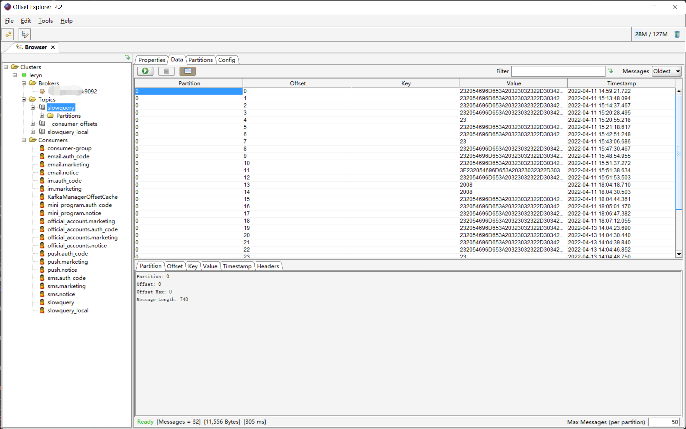

<a name="HaErR"></a>
# Kafka 安装手册
[](https://img.shields.io/static/v1?label=kafka&message=2.7.0&color=black&style=plastic&logo=Apache%20Kafka&logoColor=white?longCache=true)<br />参考文档:

- [Kafka - 官网](https://kafka.apache.org/)
<a name="sCAmV"></a>
## Docker 安装
很遗憾，Kafka 没有官方镜像，以下是推荐的镜像。
> **wurstmeister/kafka**
>   [](https://img.shields.io/docker/stars/wurstmeister/kafka.svg)
> 只包含了 Kafka，因此需要另行提供 ZooKeeper，推荐使用同一作者提交的 wurstmeister/zookeeper
> 
> **landoop/fast-data-dev**
> 提供了一整套包括 Kafka、ZooKeeper、Schema Registry、Kafka-Connect 等在内的多种开发工具和 Web UI 监视系统。基本上是我见过的最强大的开发环境，尤其是对于 Kafka。
> Connect 的支持，包含了 MongoDB，ElasticSearch，Twitter 等超过 20 种 Connector，并且提供了通过 REST API 提交 Connector 配置的 Web UI。

这里选择`wurstmeister/kafka`镜像，这里假设已经拥有了一个可用的外部 Zookeeper:
```bash
docker run \
  --detach=true \
  --env=KAFKA_ADVERTISED_HOST_NAME=localhost \
  --env=KAFKA_ADVERTISED_LISTENERS=PLAINTEXT://121.196.30.39:9092 \
  --env=KAFKA_LISTENERS=PLAINTEXT://0.0.0.0:9092 \
  --env=KAFKA_ZOOKEEPER_CONNECT=121.196.30.39:2181 \
  --name=kafka \
  --hostname=kafka \
  --publish=9092:9092 \
  --volume=/data/kafka/:/kafka/kafka-logs-kafka \
  --name=kafka \
  --hostname=kafka \
  wurstmeister/kafka:2.13-2.8.1
```
<a name="gKzja"></a>
## 二进制安装
<a name="zz3rh"></a>
### 前置准备

部署准备，安装前需要准备如下材料：

- JRE 环境：至少 Java 8
- ZooKeeper 环境，可以正常使用的 Zookeeper 环境即可，当然也可以使用 Kafka 内置的 ZooKeeper。2.8 以上的版本，Kafka 使用了 Raft 机制可以不使用 ZooKeeper 作为注册中心，当然新特性还不完全稳定
- Kafka 安装包，安装包上的两个数字前者表示 Scala 的版本，后者表示 Kafka 自身的版本。官方推荐 Scala 的版本为 2.13

下载 Kafka 的 tar 包

```bash
wget https://www.apache.org/dyn/closer.cgi?path=/kafka/2.7.0/kafka_2.13-2.7.0.tgz
wget https://mirrors.bfsu.edu.cn/apache/kafka/2.7.0/kafka_2.13-2.7.0.tgz
```
<a name="qf4aO"></a>
### 安装步骤
配置环境变量，并使其生效：
```bash
#!/usr/bin/env bash
# Set Kafka environment.
export KAFKA_HOME=/opt/module/kafka-2.7.0
export PATH=${PATH}:${KAFKA_HOME}/bin
```
安装 Kafka：
```bash
SCALA_VERSION=2.13
VERSION=2.7.0
tar -xf kafka_${SCALA_VERSION}-${VERSION}.tgz
mv kafka_${SCALA_VERSION}-${VERSION} /opt/module/
```

修改配置文件：<br />默认配置即可，需要注意的是必须配置 Kafka 和 ZooKeeper 监听的地址，且必须是实际路由地址，不能是`0.0.0.0`。如果需要暴露对外服务，请填写公网 IP 地址。

```properties
# The address the socket server listens on. It will get the value returned from
# java.net.InetAddress.getCanonicalHostName() if not configured.
#   FORMAT:
#     listeners = listener_name://host_name:port
#   EXAMPLE:
#     listeners = PLAINTEXT://your.host.name:9092
#listeners=PLAINTEXT://:9092
listeners=PLAINTEXT://localhost:9092
# A comma separated list of directories under which to store log files
log.dirs=/tmp/kafka-logs
# Zookeeper connection string (see zookeeper docs for details).
# This is a comma separated host:port pairs, each corresponding to a zk
# server. e.g. "127.0.0.1:3000,127.0.0.1:3001,127.0.0.1:3002".
# You can also append an optional chroot string to the urls to specify the
# root directory for all kafka znodes.
zookeeper.connect=localhost:2181
```

<a name="dKc29"></a>
### 启动与验证
启动 Kafka：与其他的中间件不同，Kafka 必须要显示的指定配置文件才能正常启动：
```bash
# 启动Kafka
bin/kafka-server-start.sh -daemon config/server.properties
# 停止Kafka
bin/kafka-server-stop.sh
```
验证 Kafka 安装是否成功：<br />官方提供了控制台上调试的接口
```bash
# 创建topic
bin/kafka-topics.sh --zookeeper localhost:2181 --create --topic test_jmx --partitions 1 --replication-factor 1
# 进入生产者, 发送测试消息
bin/kafka-console-producer.sh --broker-list localhost:9092 --topic test_jmx
# 另一个会话中, 开启消费者, 接受消息
bin/kafka-console-consumer.sh --bootstrap-server localhost:9092 --topic test_jmx --from-beginning
```
<a name="hZ4aS"></a>
## Systemd
生产通常实体机部署而非 Docker，自己写了 systemd 文件：
```toml
[Unit]
Description=ZooKeeper-3.6.3 service
Wants=network-online.target
After=syslog.target
After=network.target

[Service]
Type=forking
Environment=ZOO_LOG_DIR=/data/zookeeper/logs
Environment="PATH=/usr/local/sbin:/usr/local/bin:/usr/sbin:/usr/bin:/sbin:/bin:/usr/local/jdk1.8.0_231/bin"
User=root
Group=root
ExecStart=/opt/apache-zookeeper/bin/zkServer.sh start /opt/apache-zookeeper/conf/zoo.cfg
ExecStop=/opt/apache-zookeeper/bin/zkServer.sh stop /opt/apache-zookeeper/conf/zoo.cfg
ExecReload=/opt/apache-zookeeper/bin/zkServer.sh restart /opt/apache-zookeeper/conf/zoo.cfg

[Install]
WantedBy=multi-user.target
```
```toml
[Unit]
Description=Apache-Kafka-2.8.1 service 
After=network.target
After=zookeeper.service

[Service]
Type=simple
Environment="PATH=/usr/local/sbin:/usr/local/bin:/usr/sbin:/usr/bin:/sbin:/bin:/usr/local/jdk1.8.0_231/bin"
Environment="KAFKA_OPTS=-javaagent:/opt/kafka/libs/jmx_prometheus_javaagent-0.16.1.jar=19092:/opt/kafka/config/jmx_exporter.yml"
User=root
Group=root
ExecStart=/opt/kafka/bin/kafka-server-start.sh /opt/kafka/config/server.properties
ExecStop=/opt/kafka/bin/kafka-server-stop.sh

[Install]
WantedBy=multi-user.target
```
<a name="xMOQC"></a>
# Kafka Exporter

参考文档：

- [danielqsj/kafka_exporter - GitHub](https://github.com/danielqsj/kafka_exporter)
- [danielqsj/kafka_exporter:v1.4.2 下载 - GitHub](https://github.com/danielqsj/kafka_exporter/releases/tag/v1.4.2)

推荐 `jmx_exporter` 并用

- `jmx_exporter` 监控 jvm
- `kafka_exporter` 监控 kafka，尤其是这个 exporter 有一个指标表征了 consumer，topic，partition 对应的 offset 和 lag
<a name="jHRTw"></a>
## Systemd 文件
`/etc/kafka_exporter/kafka_exporter.conf` 写好所有的配置：

```yaml
OPTIONS=" --kafka.server=localhost:9092 --kafka.server=... "
```

```toml
[Unit]
Description=Kafka Exporter Service
After=network.target
After=kafka.service

[Service]
Type=simple
User=root
Group=root
EnvironmentFile=-/etc/kafka_exporter/kafka_exporter.conf
ExecStart=/opt/kafka_exporter/kafka_exporter $OPTIONS

[Install]
WantedBy=multi-user.target
```
<a name="avSOk"></a>
# KafkaTools 安装手册

- [https://www.kafkatool.com/download.html](https://www.kafkatool.com/download.html)

下载对应版本，安装即可。页面如下：




