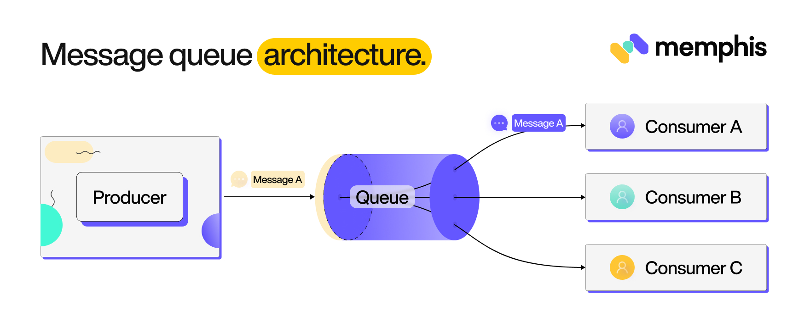

# MQ - 消息队列
队列是一种先进先出（FIFO）的消息结构，例如创建 Java 中的线程池就需要一个阻塞队列。

如果存放的消息队列作为独立的中间件存在时，它就是消息队列。

使用消息队列有 3 个优势：

+ 解耦：解除业务系统之间的强耦合
+ 异步：将时效性不高的业务转换为异步操作
+ 削峰：将瞬间的峰值业务流量累积在队列中分摊消费

常见的消息队列有：

+ Kafka
+ RabbitMQ
+ RocketMQ
+ ActiveMQ

