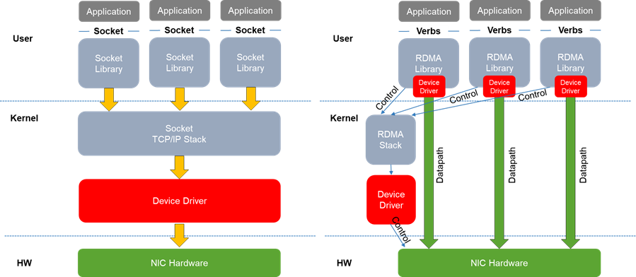
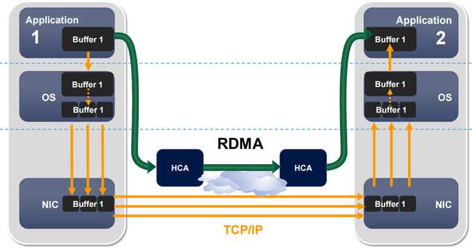

# IB 和 RoCE 网络介绍

## IB 网络
IB 网络就是 InfiniBand 网络，即无限带宽网络。一种需要特殊软硬件支持的网络架构，特点是高带宽、低延时、高可靠的网络互联技术，一般用于数据中心内部、GPU计算集群的组网。
它与以太网对比：

- 高带宽、低延时
- 简单的网络管理和后期维护
- 需要支持专用协议的网络设备（IB 交换机和 IB 线缆），成本昂贵（一根 IB 专用线缆，价格在上万元水平）
- 没有三层组网，没有二层组网的泛洪问题，也不需要 VLAN
- 通信距离有限
- 支持 RDMA 技术，可以实现同网络内跨机器读取网络包数据、内存数据，且不需要操作系统参与调度（即零拷贝、无 CPU 开销）

IB 网卡的设备没有以太网中的 MAC 地址，取而代之的是专属的 UUID。

## RoCE 网络
RoCE（RDMA over Converged Ethernet）

|  | IB | RoCE v2 |
| --- | --- | --- |
| 端到端时延 | 2us | 5us |
| 带宽 | 1.6T/Server; 400Gbps HCA | 1.6T/Server; 400Gbps HCA |
| 稳定性 | 最好 | 较好（拥塞、丢包机制） |
| 扩展性 | 高 | 高（万卡规模吞吐较弱） |
| 运维难度 | 低 | 高（配置复杂） |
| 开放性 | 完全闭源 | 开源，基于以太网，通用性强 |
| 建设成本 | 高，3 倍 | 较低 |
| 代表厂家 | 英伟达独家 | 很多 |

