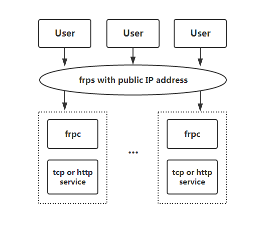

# 内网穿透
内网穿透（Intranet Penetration）工具有很多，也有一些服务商专业提供这些功能，比如洋葱。

## frp
参考文档：

+ [GitHub - fatedier/frp: A fast reverse proxy to help you expose a local server behind a NAT or firewall to the internet.](https://github.com/fatedier/frp)
+ [frp/README_zh.md at dev · fatedier/frp](https://github.com/fatedier/frp/blob/dev/README_zh.md)

frp 是一款开源的内网穿透工具。




### 安装步骤
需要分别部署服务端和客户端来完成内网穿透。以一个内网穿透 ssh 到本地 PC 为例子：

> internet → frps:bindPort → frpc:remotePort → frpc:localPort → ssh
>

配置服务端配置文件 `frps.toml`：

```toml
# frps.toml
bindPort = 7000
```

启动服务端 `frps`：

```bash
./frps -c ./frps.toml
```

配置客户端配置文件 `frpc.toml`：

```toml
# frpc.toml
serverAddr = "xxx.xxx.xxx.xxx"
serverPort = 7000

[[proxies]]
name = "ssh"
type = "tcp"
localIP = "127.0.0.1"
localPort = 22
remotePort = 8022
```

启动客户端 `frpc`：

```bash
./frpc -c ./frpc.toml
```

最后开启 ssh：

```toml
# MacOS ssh server
sudo systemsetup -setremotelogin on
```

