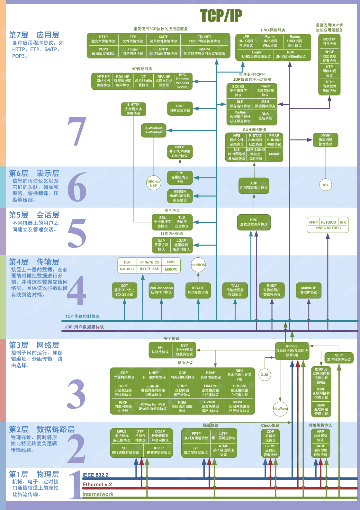

# 网络栈

## OSI 七层模型
**OSI模型**，即**开放式通信系统互联参考模型（Open System Interconnection Reference Model）**，是国际标准化组织（ISO）提出的一个试图使各种计算机在世界范围内互连为网络的标准框架。
OSI定义了网络互连的七层模型（物理层、数据链路层、网络层、传输层、会话层、表示层、应用层），如下图所示：

## TCP/IP 五层模型
和 OSI 七层模型的区别：

- TCP/IP 协议中的应用层处理开放式系统互联模型（OSI）中的第五层、第六层和第七层的功能。
- TCP/IP协议中的传输层不能保证数据包在该层总是能够安全可靠地传输，而开放式系统互联模型（OSI）可以做到。
- TCP/IP协议还提供一项名为 UDP（用户数据报协议）的选择。

## 常见协议
以我工作经验中遇到过的常用协议：

- ARP
- IP
- TCP
- UDP
- LDAP
- SSL
- TLS
- RPC
- HTTP/HTTPS
