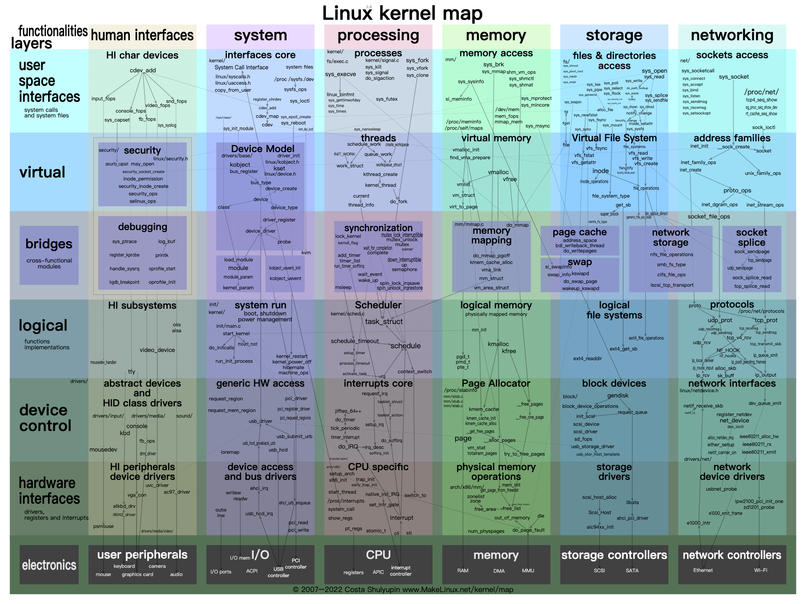

参考文档：

+ [Systemd 入门教程：命令篇 - 阮一峰的网络日志](https://ruanyifeng.com/blog/2016/03/systemd-tutorial-commands.html)

## Kernel 引导文件
### vmlinuz
vmlinux 是未压缩的内核 ELF 文件，它是不可引导形式的内核。同时也是生产 vmlinuz 的中间产物，通常用于内核开发和调试分析。

vmlinuz 是可引导的压缩内核，位于`/boot/vmlinuz`，软连接到具体版本的 vmlinuz，例如`/boot/vmlinuz-5.15.0-48-generic`。引导系统时，引导加载程序会从引导设备读取 vmlinuz，并解压缩到内存中。

有两种格式 zImage 和 bzImage。这两种压缩都会在开头内嵌一段 gzip 解压代码，所以不能通过 gzip 命令直接解包。区别是 zImage 解压内核到低端内存（第一个 640k），而 bzImage 解压到高端内存（1M 以上）。

uImage 是 uboot 专用镜像，它在 zImage 前加上了长度为 0x40 的头信息，包含了镜像类型、加载位置、生成时间、大小。

### initrd

## Linux 内核组件

