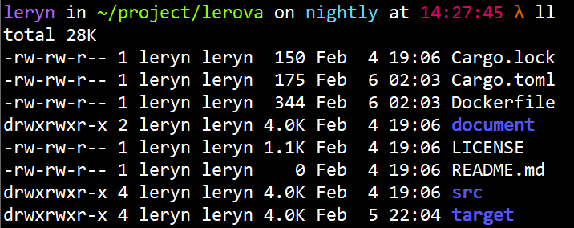

# Linux 常见命令
针对 Ubuntu，原因提到过很多次：

- 很多软件开发者都以 Ubuntu 作为开发机；
-  Linux 内核会为 OCI 让路，CentOS 发布模式跟不上内核修改的频率；
- CentOS 的时代已经过去了；

如果你是用 Arch 等等深度用户，请当以上放屁。

## 切换 oh-my-zsh
oh-my-zsh 是一个预配置的 zsh，性能比 zsh 差。但好在免配置，zsh 手动配置比较复杂。

### 命令行安装

1. 需要先安装 zsh：
```bash
apt update && apt install -y zsh
```

2. 网络不通的话可以直接下载这个 shell 脚本的内容，再执行：
```bash
sh -c "$(curl -fsSL https://raw.githubusercontent.com/ohmyzsh/ohmyzsh/master/tools/install.sh)"
```

3. 修改 `.zshrc`：
```bash
ZSH_THEME="half-life"
```
下面是搜罗的比较好看的主题, 加入到 `.zshrc` 末尾：
```bash
PROMPT=$'%{$purple%}%n%{$reset_color%} in %{$limegreen%}%~%{$reset_color%}$(ruby_prompt_info " with%{$fg[red]%} " v g "%{$reset_color%}")$vcs_info_msg_0_%{$orange%}%{$reset_color%} at %{$hotpink%}%* %{$orange%}λ%{$reset_color%} '
```



## Starship
参考文档：

- [Starship - 官网](https://starship.rs/)
- [Starship - GitHub](https://github.com/starship/starship)
- [Nerd 字体下载](https://www.nerdfonts.com/font-downloads)

### Nerd 字体
首先需要安装一套 Nerd 字体给 Terminal，目的是为了能够显示特殊符号。

### 安装 starship
各种系统都提供了对应的安装方式，我这里选择 Linux 默认：
```bash
sh -c "$(curl -fsSL https://starship.rs/install.sh)"
```

### 为指定 shell 启动 starship
这是使用 bash 或者 zsh：
```bash
# ~/.bashrc
eval "$(starship init bash)"

# ~/.zshrc
eval "$(starship init zsh)"
```

### 配置 starship
```bash
vim ~/.config/starship.toml
```

## 切换 nushell
参考文档：

- [nushell - GitHub](https://github.com/nushell/nushell)

nushell 是一个 GitHub 开源的新式 shell，基于 rust 编写。目前还不能像其他 shell 一样通用。

### 命令行安装
切换为默认 shell：
```bash
ln -s $PWD/nu /usr/bin/nu
command -v nu | sudo tee -a /etc/shells
chsh -s /usr/bin/nu
```

## 清理空间
适用**非生产环境**：
清理`journalctl`的日志，这块通常不会很大，但是如果 daemon 服务经常报错，那么会有占一部分空间：
```
journalctl --vacuum-size=50M
```
**非生产环境**推荐使用开源命令行工具。在 TB 级别时，请结合 `du -sh`再跳往较小的子目录上使用：
```
sudo ncdu /
```

## 网络有关

### 临时占用端口
用于临时占用端口，测试端口是否通。
```bash
nc -l <Port>
```

### 修改网卡

#### Ubuntu 修改网卡
```bash
# 文件名取决于网卡名
vim /etc/netplan/*.yaml

# 启用网卡配置
netplan apply
```

#### Centos 修改网卡
如果使用克隆虚拟机的方式，需要将 IP 地址改为静态 IP，需要改两个配置文件。`ifcfg-eth0`的结尾应当和网络名保持一致，这里以`eth0`为例。需要保证同一子网中，MAC 地址和 UUID 应当是唯一的。
```bash
# 文件名取决于网卡名
sudo vim /etc/sysconfig/network-scripts/ifcfg-eth0
```
```properties
DEVICE="eth0"
BOOTPROTO=static
IPADDR=192.168.87.xxx
NETMASK=255.255.255.0
GATEWAY=192.168.87.xxx
DNS1=8.8.8.8
HWADDR="00:0C:29:DB:22:A1"
IPV6INIT="yes"
NM_CONTROLLED="yes"
ONBOOT="yes"
TYPE="Ethernet"
UUID="ee425ec8-76aa-46df-a770-e9de86a64c0d"
```
```bash
sudo vim /etc/udev/rules.d/70-persistent-net.rules
```
```
# This file was automatically generated by the /lib/udev/write_net_rules
# program, run by the persistent-net-generator.rules rules file.
#
# You can modify it, as long as you keep each rule on a single
# line, and change only the value of the NAME= key.
# PCI device 0x8086:0x100f (e1000)
SUBSYSTEM=="net", ACTION=="add", DRIVERS=="?*", ATTR{address}=="00:0c:29:db:22:a1", ATTR{type}=="1", KERNEL=="eth*", NAME="eth0"
```
重启网卡服务，如果有问题就重启，如果仍然不能上网，请确认配置是否正确。
```bash
service network restart
```

## 磁盘扩容
扩展服务器硬盘容量，以超融合虚拟机为例，操作系统为 CentOS 7，其他操作系统或实体机可能不适用。

### 准备
扩展前先查看修改前的初始状态，命令的意义后面会有解释。

### 方式一: 现有磁盘扩容
注意：分区至多 3 块。大于 3 则需要增加硬盘的方式。
```bash
# 先看目前的分区情况
lsblk

# 查看硬盘情况
fdisk -l

# 到超融合先界面增加磁盘大小
# 查看是否增加了磁盘大小
lsblk

# 为扩容部分分区. vdb为对应磁盘名, 注意修改. lsblk可以看到
fdisk /dev/vda

# 根据分区创建物理卷PV. vda3注意修改. 创建分区时会给序号. 分区完成reboot之后, lsblk可以看到新增的分区
pvcreate /dev/vda3

# 查看逻辑卷名称. VG Name
lvdisplay

# 分配到对应的逻辑卷组. centos改为对应的VG Name, /dev/vda3改为新增的分区
vgextend centos /dev/vda3

# 查看挂载路径
df -h

# 扩容逻辑卷. /dev/mapper/centos-root 改为 df -h显示的对应挂载路径
lvextend -l +100%free /dev/mapper/centos-root

# 调整文件系统大小. 针对xfs格式. 如果有报错, 参考后文的ext格式扩容
xfs_growfs /dev/mapper/centos-root
```

### 方式二: 新增一块硬盘扩容
```bash
# 到超融合先界面添加一块硬盘.
# 查看是否增加了磁盘.
lsblk

# 为扩容部分硬盘分区. vdb为对应磁盘名, 注意修改. lsblk可以看到.
fdisk /dev/vdb

# 根据分区创建物理卷PV. vdb注意修改. 创建分区时会给序号. 分区完成reboot之后, lsblk可以看到新增的分区
pvcreate /dev/vdb1

# 查看逻辑卷名称. VG Name
lvdisplay

# 分配到对应的逻辑卷组. centos改为对应的VG Name, /dev/vdb1改为新增的分区
vgextend centos /dev/vdb1

# 查看挂载路径
df -h

# 扩容逻辑卷. /dev/mapper/centos-root 改为 df -h显示的对应挂载路径.
lvextend -l +100%free /dev/mapper/centos-root

# 调整文件系统大小. 针对xfs格式. 如果有报错, 参考后文的ext格式扩容.
xfs_growfs /dev/mapper/centos-root
```

## 定时任务
Ubuntu 似乎没有默认配置邮件系统，因此 crontab 报错时无法得到可靠错误信息。安装 sendmail 即可：
```bash
# 安装 sendmail
apt install -y sendmail

# 查看 cron 日志
tail -f /var/spool/mail/$(whoami)
```
不推荐做以下内容，你可能无法获得任何有效信息。
```bash
# 修改 rsyslog
vim /etc/rsyslog.d/50-default.conf

# 搜索 cron 把如下行之前的注释"#"去掉
#cron.*                         /var/log/cron.log

# 重启 rsyslog
systemctl restart rsyslog.service

# 查看日志
tail -f /var/log/cron.log
```

## XShell SSH 以外的数据包
XShell 用 SSH 连接服务器出现：
> 服务器发送了一个意外的数据包.
> received:3,expected:20

**解决方法**
在`/etc/ssh/sshd_config`结尾添加一行记录，然后重启 sshd
```bash
sudo vim /etc/ssh/sshd_config
```
```nginx
KexAlgorithms curve25519-sha256@libssh.org,ecdh-sha2-nistp256,ecdh-sha2-nistp384,ecdh-sha2-nistp521,diffie-hellman-group14-sha1
```
```bash
systemctl restart sshd
```

# Linux 开源软件

## sshwifty - 开源 Web SSH
开源的 Web SSH 应用。
```bash
openssl req \
  -newkey rsa:4096 -nodes -keyout domain.key -x509 -days 90 -out domain.crt
```
```bash
docker run \
  --detach=true \
  --env=SSHWIFTY_DOCKER_TLSCERT="$(cat ~/domain.crt)" \
  --env=SSHWIFTY_DOCKER_TLSCERTKEY="$(cat ~/domain.key)" \
  --publish=8182:8182 \
  --restart=always \
  --name=sshwifty \
  --hostname=sshwifty \
  niruix/sshwifty:latest
```
