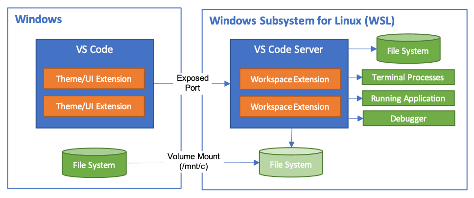
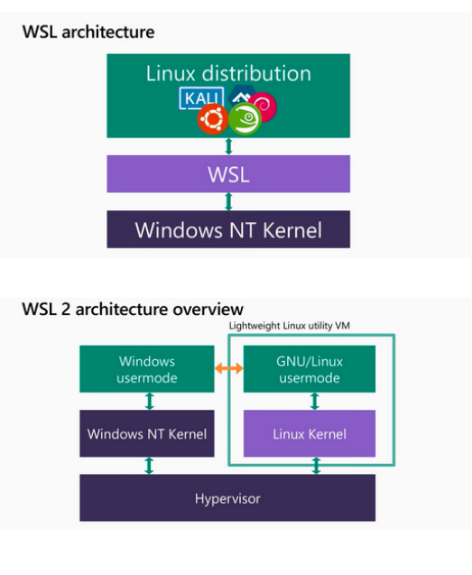

# WSL - Windows Subsystem Linux
WSL（Windows Subsystem Linux）是 Windows 操作系统内置的 Linux 子系统，类似 WSA（Windows Subsystem Android），不过后者已经停止维护了。

## 安装方法
首先，需要开启 Windows Hyper-V 虚拟机，然后可以在微软商店下载 Ubuntu WSL 或 Fedora WSL。

+ WSL 1 在 Windows NT 上启动了一个虚拟化平台，其上可以运行各种 Linux 发行版。
+ WSL 2 在裸金属上启动了 Hypervisor 虚拟机，Hypervisor 上运行了两个平级 Windows NT 和 Linux 子系统。

