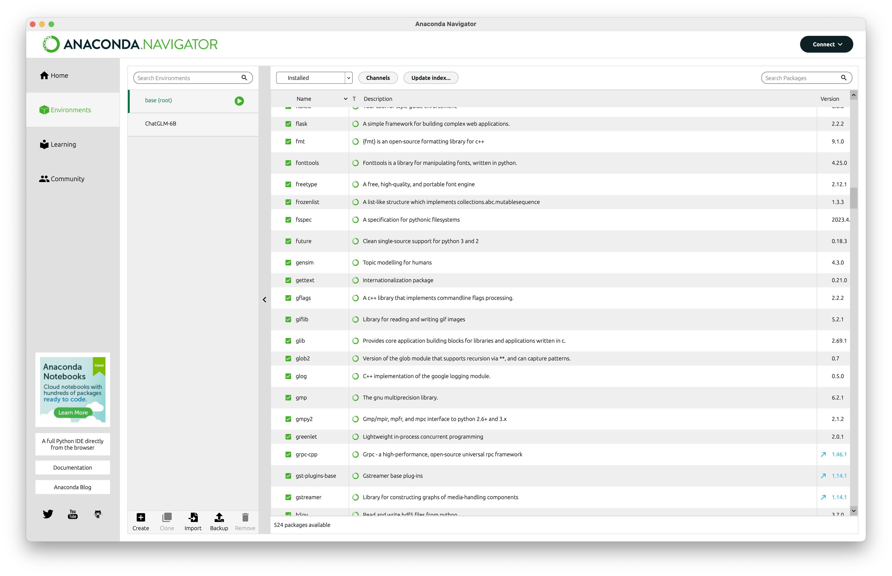

# Anaconda
Anaconda 是一款常用的 Python 虚拟环境管理工具。

创建 venv：

```bash
conda create -n chatglm-6b
conda activate chatglm-6b
```

退出 venv：

```bash
# 关闭自动激活 conda
conda config --set auto_activate_base false

conda deactivate

conda activate base
```

换国内 pip 源：

```bash
conda config --add channels https://mirrors.tuna.tsinghua.edu.cn/anaconda/pkgs/main
conda config --add channels https://mirrors.tuna.tsinghua.edu.cn/anaconda/pkgs/free
conda config --add channels https://mirrors.tuna.tsinghua.edu.cn/anaconda/pkgs/r
conda config --add channels https://mirrors.tuna.tsinghua.edu.cn/anaconda/cloud/conda-forge 
conda config --add channels https://mirrors.tuna.tsinghua.edu.cn/anaconda/cloud/msys2/

conda config --set show_channel_urls yes
```

查看 venv：

```bash
conda env list
```




