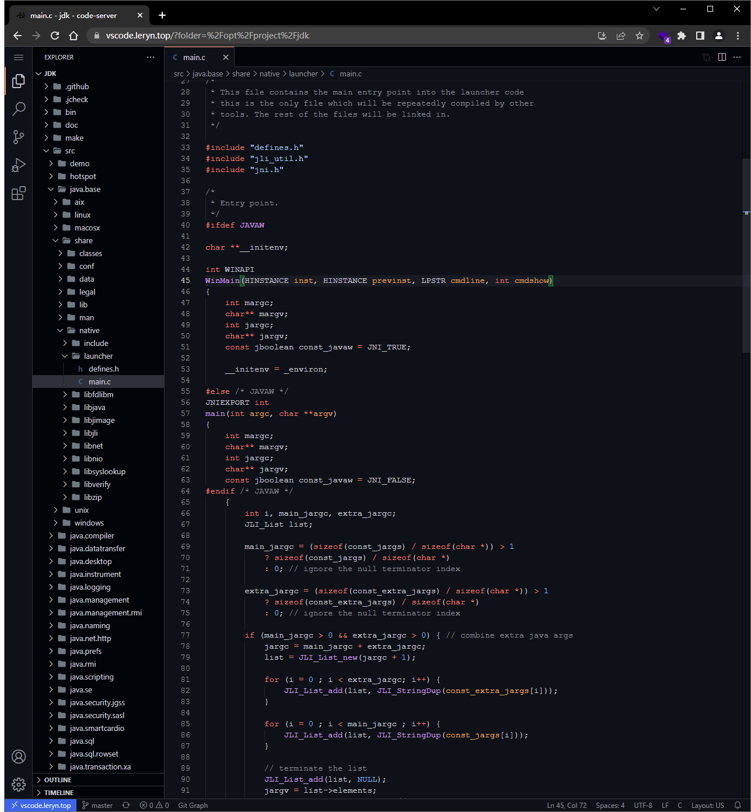

<a name="R534u"></a>
# Code Server - VS Code 网页版
参考文档:

- [https://github.com/coder/code-server](https://github.com/coder/code-server)
- [https://coder.com/docs/code-server/latest/guide](https://coder.com/docs/code-server/latest/guide)
<a name="goppM"></a>
## 安装方式的选择

- 可以使用 docker 安装, 但不是很推荐, 因为 docker 容器中没有对应的工具链. 你可以使用 Dockerfile 构造含有相应工具链的开发环境, 但如果需要比较多的工具时, 不是非常方便. 我本人需要多语言开发环境, 同时需要 debug 调试
- 可以使用 debian 或者 rpm 安装, 但是我的网速优先安装不成功.
- 因此使用了二进制安装, 并 Systemd 的方式启动.

目前有安全隐患~~ (~~`~~root~~`~~ 开启终端直接进入本地, 这是隐患不是 bug) ~~还没时间解决, 官方也建议使用非 `root` 来运行这个 Code Server.
<a name="EX3VV"></a>
## Docker 安装
```bash
docker run \
  --detach=true \
  --env=PASSWORD=VsCode123 \
  --env=TZ=Asia/Shanghai \
  --env=DOCKER_USER=$USER \
  --publish=8193:8080 \
  --restart=always \
  --name=vscode \
  --hostname=vscode \
  --user="$(id -u):$(id -g)" \
  --volume=$HOME:/root \
  --volume=/opt/project:/opt/project \
  codercom/code-server:latest

docker stop vscode && docker rm vscode
docker run \
  --detach=true \
  --env=PASSWORD=VsCode123 \
  --env=TZ=Asia/Shanghai \
  --env=DOCKER_USER=$USER \
  --publish=8183:8080 \
  --restart=always \
  --name=vscode \
  --hostname=vscode \
  --volume=$HOME:/root \
  --volume=/opt/project:/opt/project \
  harbor.leryn.top/infra/code-server:nightly
```
Dockerfile 例子, 构造一个含有多语言工具链的镜像, 镜像体积可能会比较大.
```dockerfile
FROM codercom/code-server:latest

USER root
ENV USER=root
WORKDIR /root

RUN { \
        echo "deb https://mirrors.tuna.tsinghua.edu.cn/debian/ bullseye main contrib non-free"; \
        echo "deb https://mirrors.tuna.tsinghua.edu.cn/debian/ bullseye-updates main contrib non-free"; \
        echo "deb https://mirrors.tuna.tsinghua.edu.cn/debian/ bullseye-backports main contrib non-free"; \
        echo "deb https://mirrors.tuna.tsinghua.edu.cn/debian-security bullseye-security main contrib non-free"; \
        echo "deb https://mirrors.bfsu.edu.cn/debian/ bullseye main contrib non-free"; \
        echo "deb https://mirrors.bfsu.edu.cn/debian/ bullseye-updates main contrib non-free"; \
        echo "deb https://mirrors.bfsu.edu.cn/debian/ bullseye-backports main contrib non-free"; \
        echo "deb https://mirrors.bfsu.edu.cn/debian-security bullseye-security main contrib non-free"; \
    } > /etc/apt/sources.list \
      && \ 
    apt update && apt install -f -y \
        apt-transport-https ca-certificates \
        git vim-common \
        gcc g++ cmake make gdb \
        # openjdk-17-jdk maven gradle \
        # nodejs npm \
        # pip \
        # golang \
      && \
    rm -rf /var/lib/apt/lists/*

```
<a name="GF8sf"></a>
## 二进制安装
```bash
wget https://github.com/coder/code-server/releases/download/v4.5.0/code-server-4.5.0-linux-amd64.tar.gz
tar -xf code-server-4.5.0-linux-amd64.tar.gz -C /opt/middleware
ln -s code-server-4.5.0-linux-amd64 code-server
ln -s /opt/middleware/code-server/code-server /usr/local/bin/code-server
```
<a name="LtvTc"></a>
### Systemd
```toml
[Unit]
Description=Code Server (coder.com)
Documentation=https://github.com/coder/code-server
Wants=network-online.target
After=network-online.target

[Service]
Type=simple
Restart=always
RestartSec=10s
ExecStart=/usr/local/bin/code-server
ExecReload=/bin/kill -HUP $MAINPID
KillMode=process

[Install]
WantedBy=multi-user.target
```

